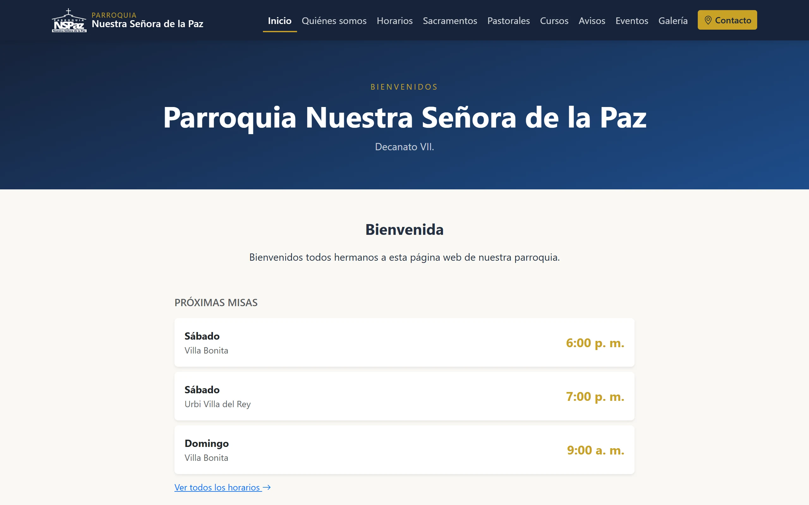
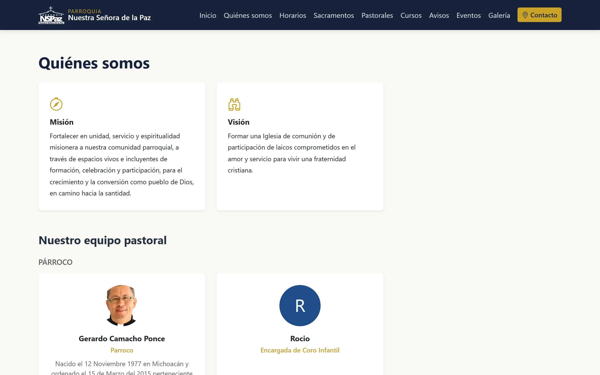
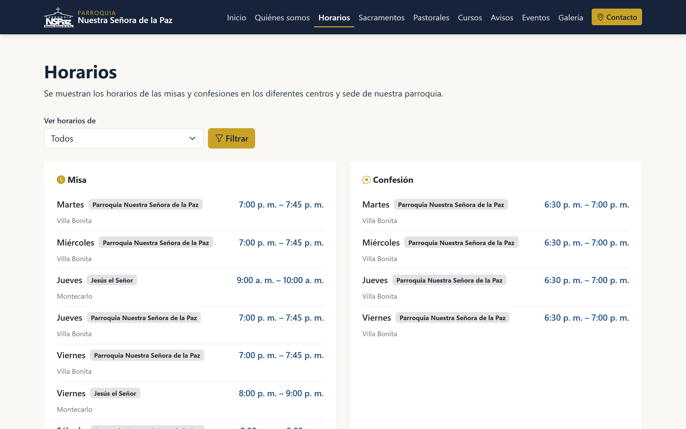
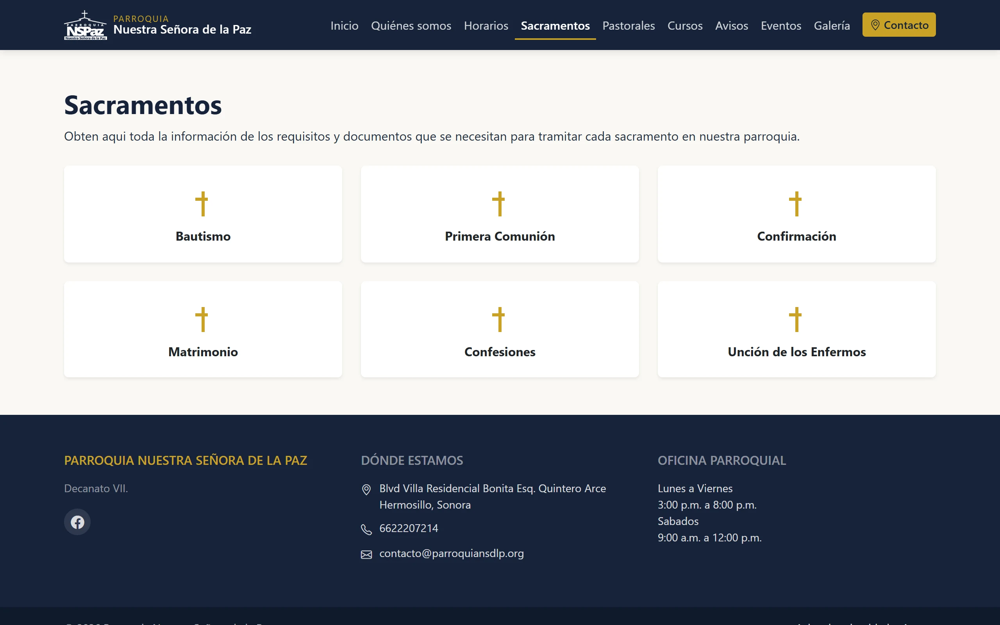
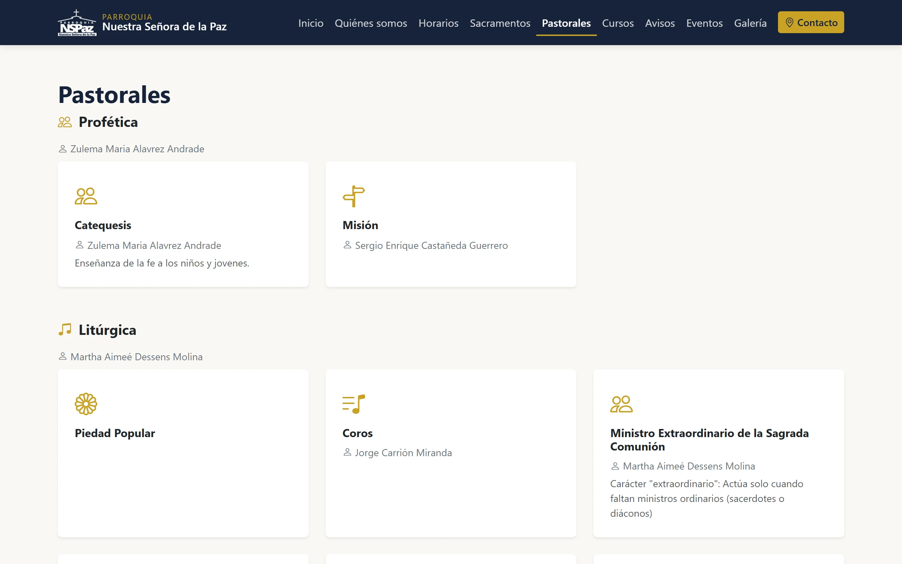
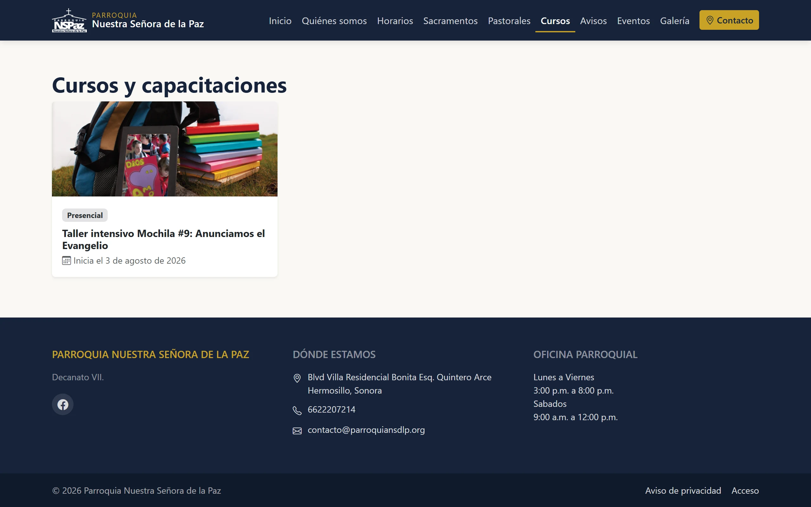
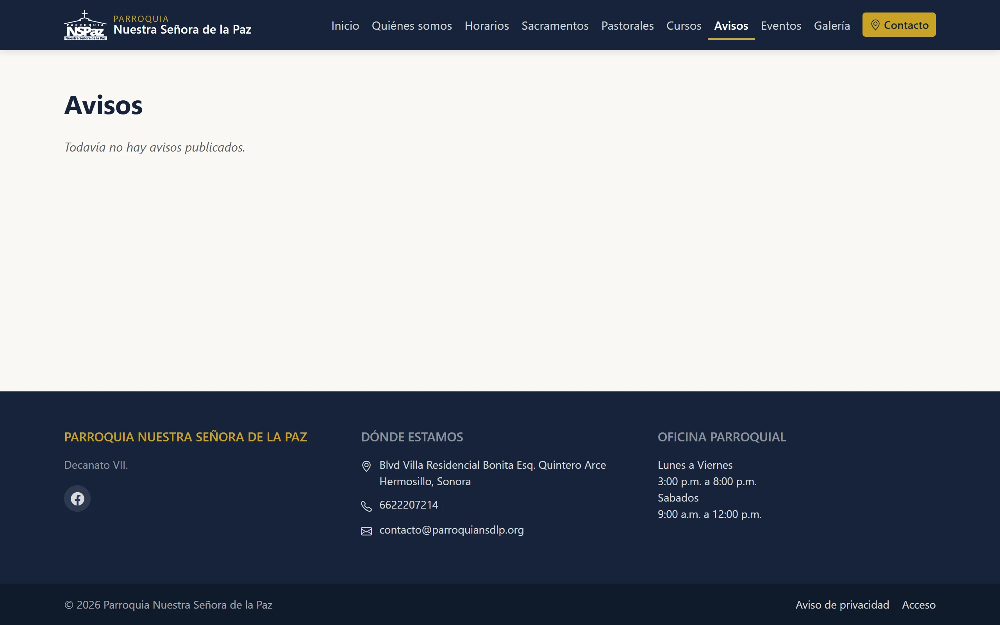
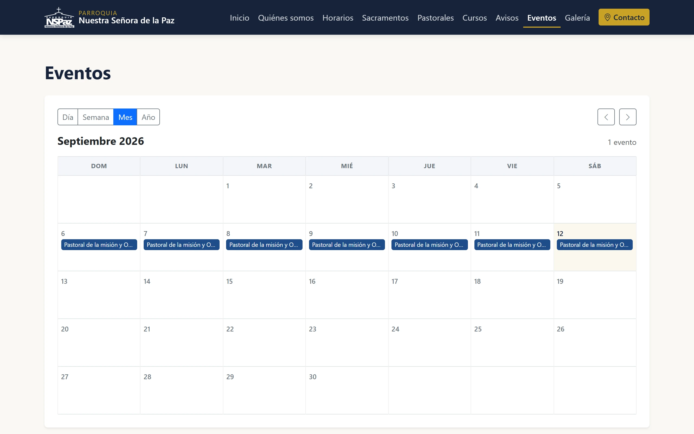
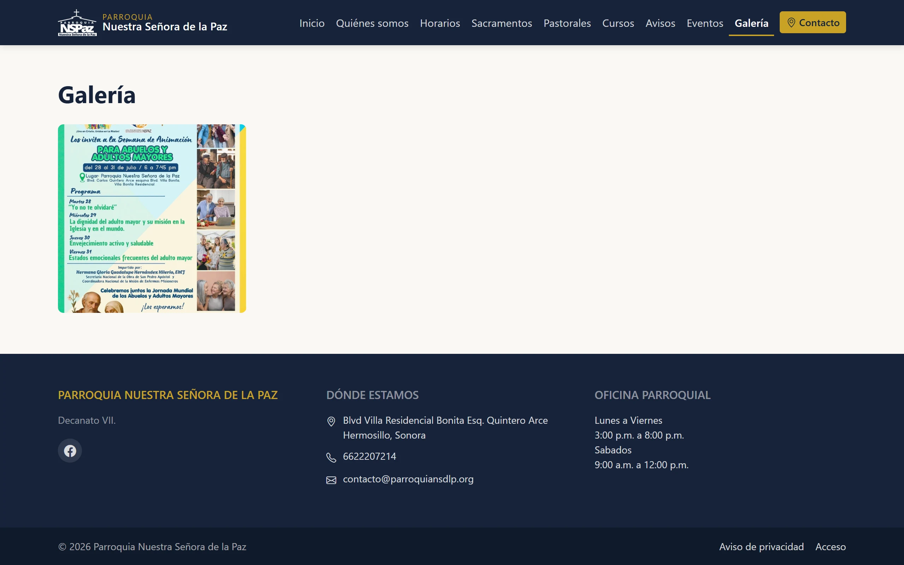
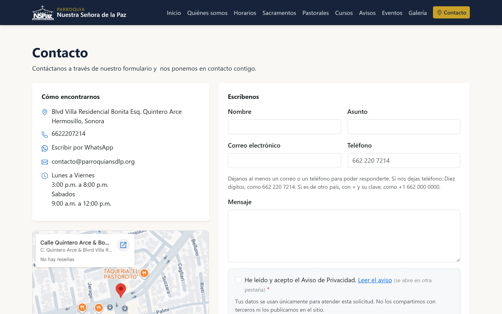

# 1. El sitio público

Esta es la cara que ve cualquiera: no pide contraseña, no distingue entre
quien entra desde la parroquia y quien llega de fuera, y solo muestra lo que
el equipo haya marcado como publicado.

Vale la pena empezar por aquí aunque tu trabajo sea capturar en el panel:
cada pantalla del panel existe para llenar un pedazo de estas páginas, y es
más fácil entenderlas sabiendo dónde acaban.

En cada sección viene una línea **«Se llena desde…»** con la ruta del panel
que la alimenta. Esos capítulos se explican más adelante.

## El menú

Siempre visible, arriba, en todas las páginas. A la izquierda el escudo y el
nombre de la parroquia —que llevan a la portada—, y a la derecha las secciones
y un botón de **Contacto**, destacado en dorado porque es la acción que más se
busca.

El menú no es fijo: solo se dibujan las secciones que existen. Cursos, además,
se puede esconder sin borrar nada, desde **Administración → Configuración →
Secciones del sitio**, para cuando no hay convocatorias abiertas.

En un teléfono el menú se recoge en el botón de las tres rayas, y las páginas
se reacomodan a una sola columna. Todo lo que se describe aquí funciona igual
en un celular.

> **Se llena desde:** Administración → Configuración (nombre, escudo y qué
> secciones se muestran).

## La portada

Es lo primero que ve quien llega. De arriba abajo:

**El encabezado.** La franja azul con el nombre de la parroquia. Si nadie ha
cargado fotos para la portada, se dibuja así, con el nombre y el decanato sobre
el fondo azul. En cuanto se sube al menos una diapositiva, ese mismo espacio se
convierte en un carrusel de fotos que van pasando solas.

> **Se llena desde:** Comunicación → Carrusel.

**Bienvenida.** El saludo del párroco, en texto libre.

> **Se llena desde:** Contenido → Bloques.

**Evangelio del día.** Cuando el párroco publica la lectura del día —y, si le
dio tiempo, su reflexión—, aparece aquí, con la fecha. Si no hay nada publicado
para hoy, la sección sencillamente no se dibuja: no queda un hueco.

> **Se llena desde:** Contenido → Evangelio.

**Próximas misas.** Las tres siguientes, con su sede y su hora, calculadas
desde los horarios cargados. Debajo, un enlace a la página de horarios
completa.

> **Se llena desde:** Parroquia → Horarios.

**Próximos eventos.** Lo que viene en el calendario, cada uno con su día en un
recuadro. Debajo, el enlace al calendario completo.

> **Se llena desde:** Comunicación → Eventos.

**Próximos cursos y Últimos avisos.** Las convocatorias abiertas y los tres
avisos más recientes que estén publicados en el sitio. Como todo lo de esta
página, cada sección se dibuja solo si tiene algo que mostrar: si no hay avisos
vigentes, ahí no queda un hueco vacío.

> **Se llena desde:** Comunicación → Cursos y Comunicación → Avisos.

**Lo último en Facebook.** Las publicaciones recientes de la página de Facebook
de la parroquia, tal cual las muestra Facebook. No hay que copiar nada a mano:
lo que se publique allá aparece aquí solo. Basta con que la dirección de la
página esté capturada.

> **Se llena desde:** Administración → Configuración.

**Ligas de interés.** Una lista corta de enlaces —la arquidiócesis, por
ejemplo—. Si se deja vacía, no aparece.

> **Se llena desde:** Contenido → Bloques.

## Quiénes somos

La presentación de la parroquia. Tiene tres partes:

1. **Historia, misión y visión**, tres textos libres. Cada uno se dibuja solo
   si tiene contenido.
2. **Nuestro equipo pastoral**: las fichas, agrupadas por tipo en este orden
   —párroco, vicario, diácono, religioso o religiosa, laico y personal de
   oficina—, cada una con su foto, su nombre, su cargo y, si la tiene
   capturada, una semblanza. Quien no tenga foto aparece con la inicial de su
   nombre en un círculo azul, no con un hueco.
3. **El organigrama**, con la estructura de la parroquia, y un botón para
   abrirlo en una versión pensada para imprimir en forma de árbol.

**Ojo con el equipo pastoral:** aquí sale **toda persona activa**, no una
selección. Dar de alta a alguien en Parroquia → Equipo pastoral lo publica en
esta página; para que deje de aparecer hay que marcar su ficha como inactiva.
Lo que nunca sale, de nadie, es su contacto: de la ficha se publican solo el
nombre, el cargo, la foto y la semblanza.

> **Se llena desde:** Contenido → Bloques (los tres textos), Parroquia →
> Equipo pastoral (las fichas) y Parroquia → Organigrama.

## Horarios

Los horarios agrupados **por tipo** —misas en una columna, confesiones en
otra—, y dentro de cada uno, ordenados por día de la semana. Cada renglón dice
el día, la sede, la colonia y la hora.

Arriba hay un filtro **«Ver horarios de»** para quedarse con una sola sede,
útil cuando alguien busca la misa de su comunidad y no la de la parroquia
entera.

> **Se llena desde:** Parroquia → Horarios, y las sedes desde Parroquia →
> Centros.

## Sacramentos

Una tarjeta por sacramento, precedida de un texto introductorio si se capturó.
Al entrar a una se abren los requisitos y las indicaciones de ese sacramento.

Es informativo: **no hay formulario de solicitud en línea**. Se decidió así;
los trámites se hacen en la oficina parroquial, y la página está para que quien
llegue sepa de antemano qué papeles llevar.

> **Se llena desde:** Parroquia → Sacramentos, y el texto de arriba desde
> Contenido → Bloques.

## Pastorales

Todas las pastorales de la parroquia, **agrupadas por comisión** —Litúrgica,
Profética, De la Familia, De la Comunicación, Pastoral de la Salud—. Debajo del
nombre de cada comisión aparece quien la coordina, y dentro van las pastorales
que agrupa, cada una en su tarjeta con su nombre, quien la lleva y una
descripción corta.

Al entrar a una pastoral se abre su página, con lo que ella misma publica: sus
actividades, sus avisos, sus próximos eventos, sus documentos para descargar y
un recuadro de **Información** con quien la coordina, su horario de reunión y
su correo. Si es una comisión, arriba aparecen además las pastorales que
agrupa, con enlace a cada una.

Dos detalles que suelen confundir:

- **El correo es de la pastoral, no de quien la coordina.** Se escribe a mano y
  sobrevive a los relevos, en vez de publicar el correo personal de quien esté
  al frente hoy.
- **Quien coordina puede ser un matrimonio.** En Matrimonios, AMA, JECSA y
  Raíces coordina una pareja, y así aparece.

> **Se llena desde:** Parroquia → Pastorales.

## Cursos

Los cursos y capacitaciones con inscripción abierta, cada uno con su foto, si
es presencial o en línea, y la fecha en que inicia. Al entrar a uno se ven los
detalles y, si acepta inscripciones, el formulario para apuntarse.

El formulario pide los datos de contacto de quien se inscribe y, cuando se
trata de un menor, también los del tutor. Antes de enviarlo hay que aceptar el
aviso de privacidad: sin esa palomita no se manda, y queda guardado a qué
versión del aviso dijo que sí.

Las inscripciones que llegan por aquí se leen en el panel; no se envían por
correo ni se pierden.

> **Se llena desde:** Comunicación → Cursos. Las inscripciones se atienden en
> Trámites → Inscripciones.

## Avisos

Los avisos publicados, en tarjetas, del más reciente al más viejo, con su
imagen, su tipo, su fecha y las primeras líneas. Al entrar a uno se lee
completo.

Aquí hay algo importante que el capítulo de Avisos explica a fondo: **no todo
aviso llega a esta página**. Una pastoral puede publicar un aviso solo hacia
dentro, para su propia gente, y ese se queda en el panel. A esta página solo
sale lo que se publicó para el sitio.

> **Se llena desde:** Comunicación → Avisos.

## Eventos

El calendario de la parroquia, en cuatro vistas —**Día, Semana, Mes y Año**—
que se cambian con los botones de arriba a la izquierda, y flechas para
moverse al periodo anterior o siguiente. A la derecha se dice cuántos eventos
tiene el periodo que se está viendo.

Un evento que dura varios días se marca en todos sus días, no solo el primero.
Al hacer clic en cualquiera se abre su detalle.

> **Se llena desde:** Comunicación → Eventos.

## Galería

Las fotografías publicadas, en cuadrícula y por páginas. Al hacer clic en una
se abre grande, sin recortar, y se puede pasar a la siguiente con las flechas.

> **Se llena desde:** Comunicación → Galería.

## Contacto

A la izquierda, cómo encontrar a la parroquia: dirección, teléfono, un enlace
para escribir por WhatsApp, el correo, el horario de oficina y un mapa.

A la derecha, el formulario. Pide nombre, asunto, y **al menos un correo o un
teléfono** —si no, no hay manera de responder—. Igual que en las inscripciones,
hay que aceptar el aviso de privacidad antes de enviar.

Los mensajes no van a un buzón de correo: llegan al panel, donde se leen, se
marcan como atendidos y quedan guardados.

> **Se llena desde:** Administración → Configuración (dirección, teléfonos,
> horario y mapa). Los mensajes se atienden en Comunicación → Mensajes.

## El pie de página

En todas las páginas, abajo: el nombre de la parroquia, el icono de Facebook,
la dirección, los teléfonos y el horario de la oficina. Y en la última línea,
dos enlaces discretos:

- **Aviso de privacidad**, la versión vigente del aviso que se acepta en los
  formularios.
- **Acceso**, que es la puerta del panel. No está en el menú de arriba a
  propósito: el visitante no tiene por qué encontrársela, y quien trabaja en el
  panel la usa todos los días y sabe dónde está.

El capítulo 2 continúa por ahí.

## Qué no aparece nunca en el sitio

Conviene tenerlo claro desde el principio, porque es la primera duda de quien
empieza a capturar:

- **Los borradores.** Mientras un aviso, un evento, un curso o una página estén
  en borrador, nadie de fuera los ve.
- **Lo publicado solo hacia dentro.** Los avisos y cursos que una pastoral
  publica para su propia gente se quedan en el panel.
- **Los datos personales.** Los mensajes de contacto y las inscripciones a
  cursos no se publican nunca, ni completos ni en resumen. Del equipo pastoral
  salen al sitio el nombre, el cargo, la foto y la semblanza; nunca el teléfono
  ni el correo personal, que se capturan para uso del propio equipo.
