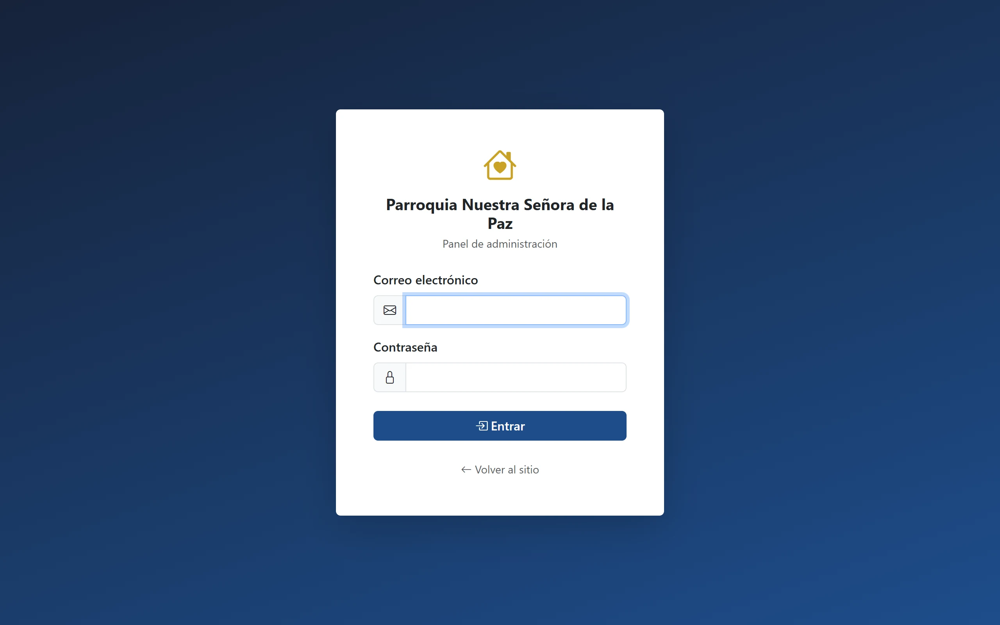
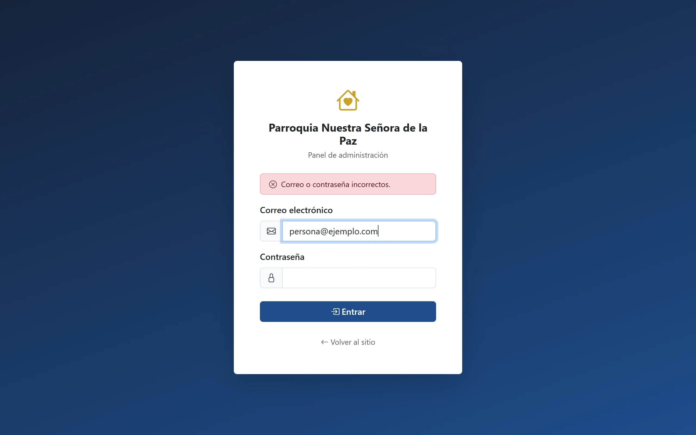
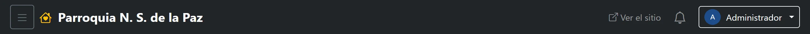
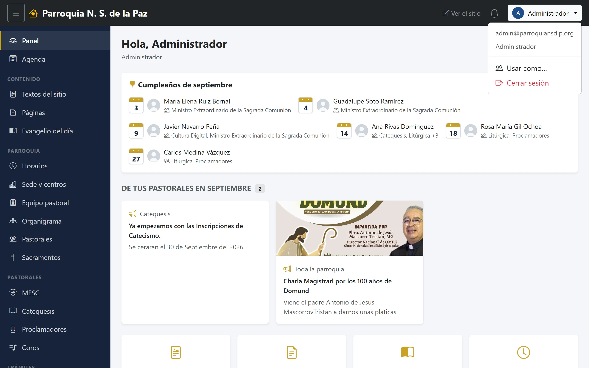

# 2. Entrar al panel

El panel es la parte del sistema donde el equipo trabaja. Está detrás de una
contraseña y no se anuncia en el menú del sitio: quien visita la página de la
parroquia no tiene por qué encontrárselo.

## Dónde está la puerta

Hay dos formas de llegar, y las dos terminan en la misma pantalla:

- **Desde el sitio**, hasta abajo de cualquier página, en la última línea del
  pie: el enlace **Acceso**.
- **Escribiendo la dirección**, agregando `/admin` al final de la dirección de
  la parroquia. Conviene guardarla en los favoritos del navegador: es la que se
  usa todos los días.

Si entras a cualquier dirección del panel sin haber iniciado sesión, el sistema
te manda aquí; y si ya habías entrado, te lleva directo a tu pantalla de inicio
sin volver a preguntarte nada.

## La pantalla de acceso

Pide dos cosas:

- **Correo electrónico.** El de tu cuenta del panel, que es el que te dieron al
  darte de alta. Suele ser tu correo de la parroquia
  (`nombre@parroquiansdlp.org`), pero puede ser cualquiera: lo importante es
  que sea el mismo con el que está registrada la cuenta.
- **Contraseña.** La tuya, de al menos ocho caracteres.

Y ya. No hay nada más que llenar. El enlace de abajo, **Volver al sitio**,
regresa a la página pública.

### Si no te deja entrar

El mensaje siempre dice lo mismo —**«Correo o contraseña incorrectos»**— aunque
el correo esté bien escrito y solo hayas fallado la contraseña. Es a propósito:
si el sistema dijera «esa contraseña no es», estaría confirmándole a cualquiera
que ese correo sí tiene cuenta en la parroquia.

Tres cosas que suelen ser la causa:

1. **Un espacio de más** al principio o al final del correo, de cuando se copia
   y pega.
2. **Mayúsculas en la contraseña**: distingue entre `Paz2026` y `paz2026`. El
   correo, en cambio, da igual cómo se escriba.
3. **La cuenta está desactivada.** Una cuenta inactiva no entra, aunque la
   contraseña sea la correcta, y el aviso que ves es el mismo. Si alguien de la
   parroquia dejó su encargo y luego volvió, es lo primero que hay que revisar.

### Si olvidaste tu contraseña

**No hay un «olvidé mi contraseña» que te mande un correo.** La contraseña te
la repone la persona que administra las cuentas:

- Si eres coordinador o consulta de una pastoral, tu **coordinación general**
  puede ponerte una nueva.
- En cualquier otro caso, el **administrador**.

Se hace en un momento, desde Administración → Usuarios, y te dan una contraseña
nueva que conviene cambiar después.

## Si tienes más de un perfil

Algunas personas hacen dos cosas distintas en la parroquia: por ejemplo,
coordinan Catequesis y además pertenecen a MESC, donde solo entran a
consultar. Eso no son dos cuentas ni dos contraseñas: es **una cuenta con un
perfil adicional**.

Cuando una cuenta tiene perfiles adicionales, después de escribir la
contraseña aparece una pantalla intermedia que pregunta **con cuál quieres
entrar**. Se elige uno y se continúa. Lo que puedes hacer durante esa sesión
es lo del perfil que elegiste, ni más ni menos.

No hay que cerrar sesión para cambiarte: en el menú de tu nombre, arriba a la
derecha, está **Cambiar de perfil**.

El capítulo 4 explica por qué existe esto y cuándo conviene pedirlo.

## La barra de arriba

Está siempre, en todas las pantallas del panel, y tiene cinco cosas:

1. **El botón de las tres rayas**, que esconde y muestra el menú lateral. Útil
   en pantallas chicas o cuando quieres ver una tabla ancha completa.
2. **El nombre de la parroquia**, que regresa a tu pantalla de inicio desde
   donde estés.
3. **Ver el sitio**, que abre la página pública en una pestaña nueva. Es la
   forma de comprobar cómo quedó lo que acabas de publicar sin perder lo que
   estás haciendo.
4. **La campana**, con lo que tienes sin leer. Se explica en el capítulo 3.
5. **Tu nombre y tu foto**, que despliegan tu menú.

## Tu menú

Al hacer clic en tu nombre se abre un menú corto que empieza recordándote con
qué cuenta estás trabajando —tu correo y tu rol—, que es justo lo que hace
falta saber cuando algo no aparece donde lo esperabas. Debajo, según tu cuenta:

- **Cambiar de perfil**, solo si tienes perfiles adicionales.
- **Usar como…**, solo para el administrador. Sirve para ver el panel con los
  ojos de otra persona; se explica en el capítulo 4.
- **Cerrar sesión**, siempre.

## Cerrar sesión

Vale la pena tomarlo en serio en la computadora de la oficina, que usan
varias personas: mientras tu sesión siga abierta, quien se siente después
trabaja **con tu nombre**, y todo lo que haga quedará registrado como hecho por
ti en la bitácora del sistema.

La sesión también se cierra sola al cerrar el navegador. Cerrar la pestaña no
basta.
