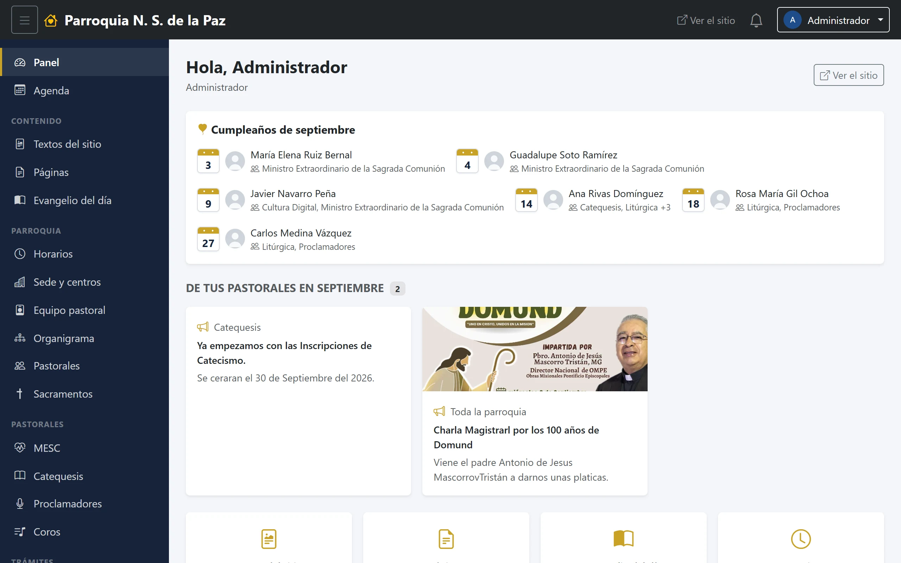
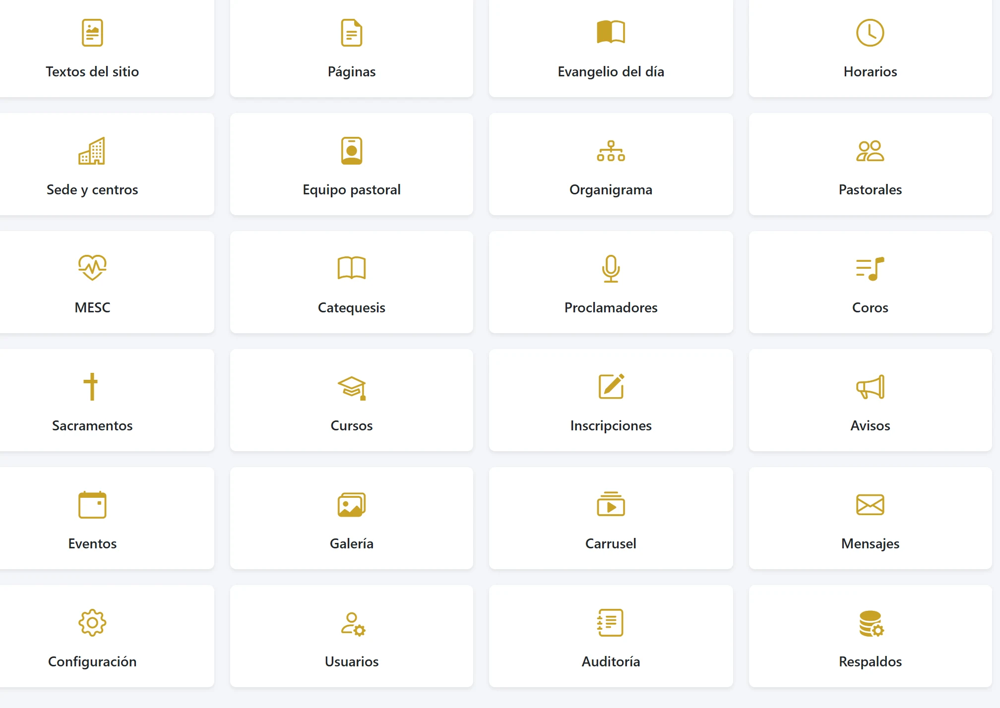
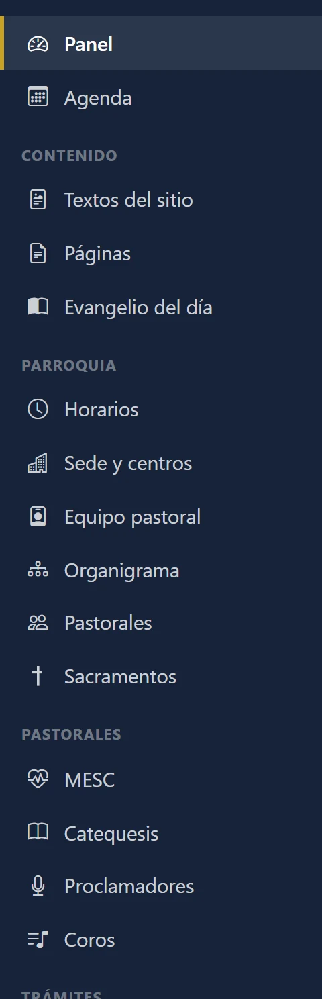
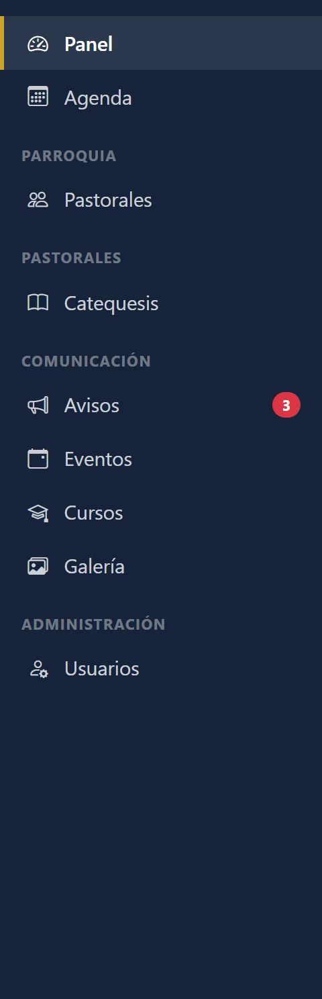
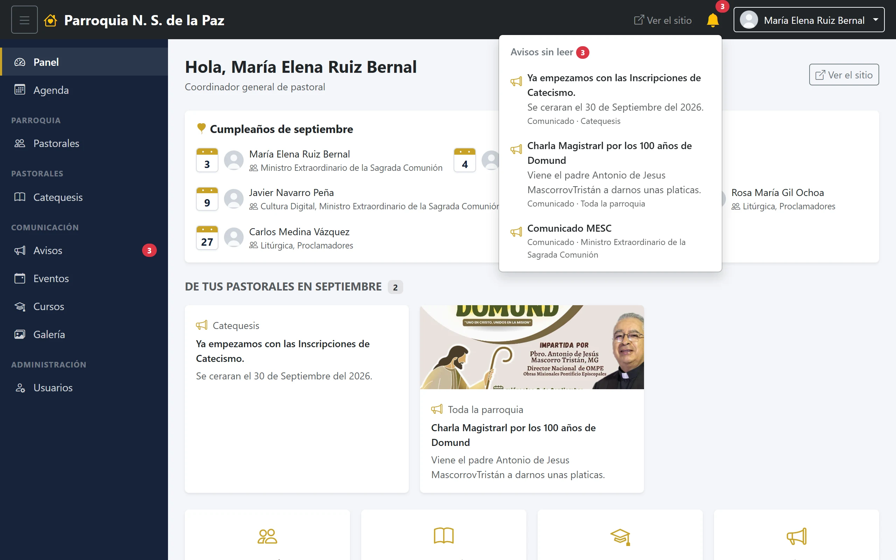
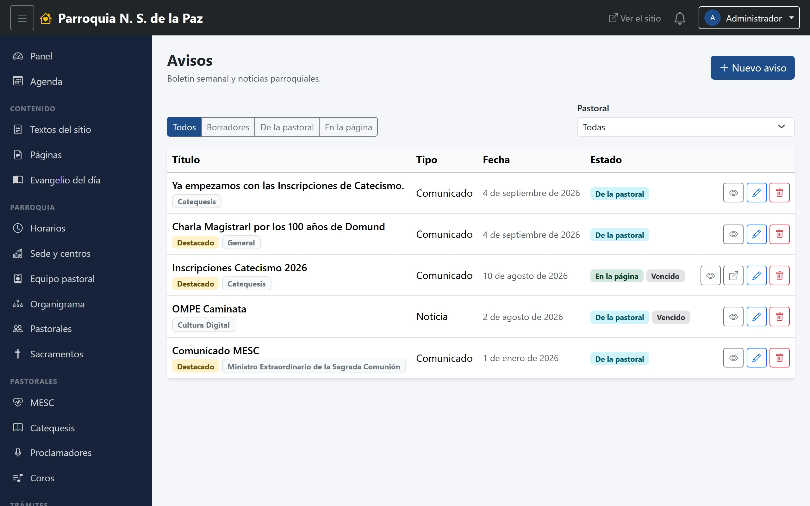

# 3. El panel por dentro

Todas las pantallas del panel están armadas igual: una barra arriba, un menú a
la izquierda y el trabajo en medio. Este capítulo explica esas tres partes y,
al final, cómo funciona cualquier listado y cualquier formulario, que es lo que
se repite en los veintitantos módulos que vienen después.

## Tu pantalla de inicio

Es lo primero que ves al entrar y no es igual para todos: está armada con lo
tuyo. De arriba abajo:

**El saludo**, con tu nombre y, debajo, tu rol. Ese renglón pequeño es más útil
de lo que parece: cuando algo no aparece donde lo esperabas, lo primero que hay
que mirar es con qué rol entraste.

**Cumpleaños del mes.** Las personas del equipo pastoral que cumplen años este
mes, con su foto y su día. Sale de las fechas capturadas en las fichas del
equipo; quien no la tenga, no aparece.

**De tus pastorales en este mes.** El tablón de lo que se ha publicado hacia
dentro: los avisos y los cursos que tus pastorales anunciaron a su gente,
mezclados y ordenados por fecha de publicación, porque a quien entra le importa
qué se anunció, no de qué sección viene. Cada tarjeta dice de qué pastoral es y
lleva un icono según su tipo.

Lo que se publicó **desde la última vez que entraste** viene marcado con una
insignia roja de **Nuevo**. No es «lo que no has abierto»: es «lo que llegó
desde tu ingreso anterior», así que si entras dos veces el mismo día, la
segunda ya no verás las marcas.

**Accesos rápidos.** Una cuadrícula con los módulos a los que tienes entrada,
para llegar de un clic sin pasar por el menú.

**Pastorales y comisiones.** Debajo, las pastorales que administras, cada una
con enlace a su panel propio.

## El menú lateral

Está agrupado por temas, y el orden es siempre el mismo:

| Sección | Qué hay ahí |
|---|---|
| *(arriba, sin título)* | **Panel**, que regresa a tu pantalla de inicio, y **Agenda**, el calendario interno del equipo |
| **Contenido** | Los textos del sitio: bloques, páginas y el evangelio del día |
| **Parroquia** | Horarios, sedes y centros, equipo pastoral, organigrama, pastorales y sacramentos |
| **Pastorales** | Los módulos propios de MESC, Catequesis, Proclamadores y Coros |
| **Trámites** | Las inscripciones a cursos |
| **Comunicación** | Avisos, eventos, cursos, galería, carrusel y mensajes |
| **Administración** | Configuración, usuarios, bitácora y respaldos |

**Tu menú probablemente es más corto que este.** Cada entrada se dibuja solo si
tu cuenta tiene permiso para esa pantalla, así que una coordinadora ve un puñado
de renglones y el administrador los ve todos. No es que las opciones estén
«escondidas»: si no están, tu cuenta no las tiene. El capítulo 4 explica quién
ve qué.

Este es el mismo menú de arriba, en la cuenta de una coordinación general de
pastoral: sin la sección de Contenido, sin Trámites, con una sola pastoral en
la sección Pastorales y con Usuarios como única entrada de Administración
—porque puede dar de alta las cuentas de su propia pastoral, y nada más—.

Los módulos de pastoral —MESC, Catequesis, Proclamadores, Coros— tienen además
una regla propia: no basta con el permiso, hay que **administrar esa pastoral
en concreto**. Por eso la coordinadora de Coros no ve el módulo de Catequesis
aunque los dos vivan en la misma sección del menú.

Dos entradas pueden traer una **insignia roja con un número**: Avisos y
Mensajes, cuando tienes cosas sin leer. Es la misma cuenta que muestra la
campana.

## La campana

Arriba a la derecha. Suma dos cosas que llegan solas al panel:

- **Los mensajes** que la gente manda por el formulario de contacto del sitio.
- **Los avisos** publicados hacia dentro que te tocan a ti.

Cuando hay algo sin leer se pone amarilla y aparece el globo rojo con la
cuenta; al pulsarla se despliega la lista, separada en sus dos grupos, y cada
renglón lleva directo a lo suyo. Si son más de cinco, el último renglón dice
cuántos faltan y lleva al listado completo.

En la captura de arriba solo aparece el grupo de **avisos**: es la campana de
una coordinación general, que no atiende los mensajes de contacto. Y eso lleva
a los tres detalles que conviene saber:

- **Solo cuenta lo que puedes abrir.** Si tu cuenta no atiende los mensajes de
  contacto, la campana no te los anuncia: sería enseñarte a medias un dato
  personal y mandarte a una pantalla que no puedes ver.
- **«Sin leer» es de verdad tuyo.** Un aviso deja de contar cuando **tú** lo
  abres, no cuando lo abre otra persona ni cuando pasa el tiempo.
- **Un aviso vencido deja de contar.** Si ya pasó su fecha de «visible hasta»,
  desaparece de la campana aunque nunca lo hayas abierto: anunciar algo que ya
  no está vigente solo estorba.

## Cómo funciona cualquier listado

Casi todos los módulos abren con una tabla, y todas las tablas funcionan igual:

- **Arriba a la derecha, el botón azul** para dar de alta algo nuevo —«Nuevo
  aviso», «Nuevo evento»—. Si no lo ves, tu cuenta puede consultar pero no
  crear.
- **Los filtros**, en una fila de botones: *Todos*, *Borradores*, *De la
  pastoral*, *En la página*. Se combinan con el selector de **Pastoral** de la
  derecha, así que «solo las mías, en borrador» es una consulta normal.
- **La tabla**, con lo más importante en las primeras columnas. En una pantalla
  angosta o en un celular, las columnas menos importantes se esconden solas; no
  se pierde nada, se ven al entrar al registro.
- **Las insignias de estado**, que dicen de un vistazo en qué escalón va cada
  cosa: *De la pastoral* cuando se publicó solo hacia dentro, *En la página*
  cuando ya se ve en el sitio, y nada de eso cuando sigue en borrador. A veces
  se les suma *Destacado* o *Vencido* —esta última, cuando ya pasó su fecha de
  «visible hasta» y por eso dejó de mostrarse—.
- **Los botones de cada renglón**, a la derecha: el ojo para leer, la flecha
  para abrirlo en el sitio —solo si ya está publicado—, el lápiz para editar y
  el bote de basura para borrar. Aparecen según lo que tu cuenta pueda hacer.
- **La paginación**, abajo, cuando hay más de una página.

## Cómo funciona cualquier formulario

- Los campos obligatorios están marcados; si falta alguno, al guardar aparece
  un aviso en rojo arriba y **no se pierde lo que ya habías escrito**.
- Al guardar bien, vuelves al listado con un aviso verde. Los avisos se cierran
  solos con su tachita y no vuelven a aparecer al recargar.
- **Borrar siempre pregunta antes**, en una ventanita de confirmación. Y unas
  pocas acciones delicadas —restaurar un respaldo, por ejemplo— además piden al
  administrador **volver a escribir su contraseña**: no es desconfianza, es que
  son cosas que no se pueden deshacer.

## Lo que queda registrado

El sistema lleva una bitácora de quién hizo qué: cada alta, cada cambio y cada
borrado quedan anotados con la cuenta que lo hizo y la fecha. No es para
vigilar a nadie; es para poder responder «¿quién despublicó el aviso?» sin que
sea una discusión. El administrador la consulta en Administración → Bitácora, y
se explica en el capítulo 22.
