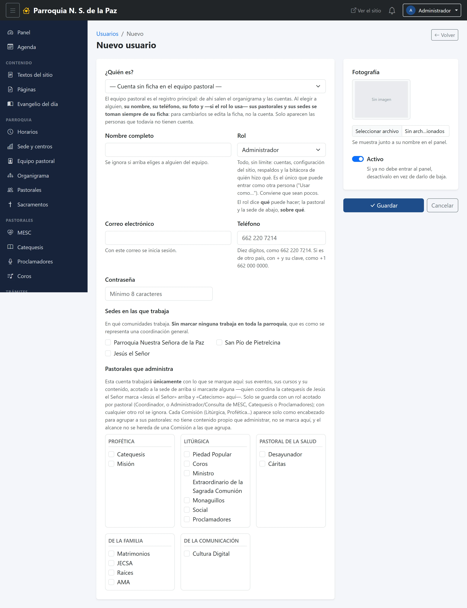
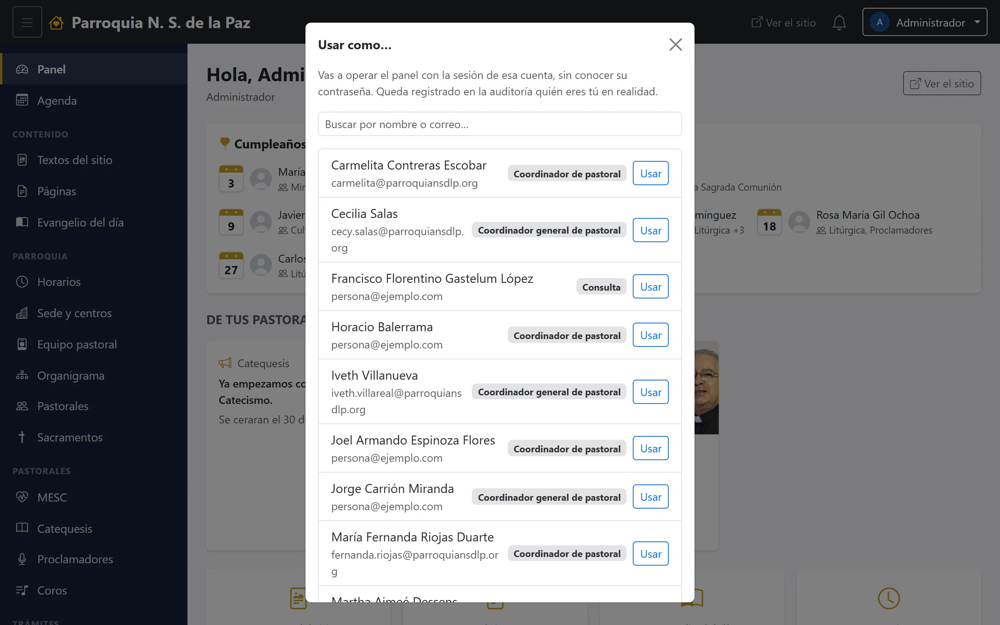

# 4. Quién puede hacer qué

Es la pregunta que aparece el primer día —«¿por qué yo no veo eso?»— y la que
hay que resolver bien antes de dar de alta una cuenta. La respuesta corta es
que cada cuenta tiene **un rol** y **un alcance**, y que son dos cosas
distintas:

> **El rol dice QUÉ puede hacer una cuenta. La pastoral y la sede dicen SOBRE
> QUÉ.**

Por eso no existe un rol llamado «Coordinadora de Catequesis». «Coordinadora de
Catequesis en Jesús el Señor» es el rol **Coordinador**, con la pastoral
*Catequesis* y la sede *Jesús el Señor* marcadas en su cuenta. Antes sí había
roles con la pastoral en el nombre; se retiraron el día que aparecieron tres
coordinadoras de catequesis —la de la parroquia, la de San Pío y la de Jesús el
Señor— que ese esquema no sabía distinguir.

## Los seis roles

### Administrador

Todo, sin límite: cuentas, configuración del sitio, respaldos y la bitácora de
quién hizo qué. Es el único que puede entrar como otra persona («Usar como…»).

Conviene que sean pocos: dos, idealmente, para que nunca haya uno solo con las
llaves.

### Editor

Todo el contenido del sitio —textos, páginas, horarios, equipo pastoral,
avisos, eventos, galería, cursos y las fichas de todas las pastorales—, sin
límite de pastoral.

No toca cuentas ni configuración, y **no ve datos personales**: ni los mensajes
de contacto ni las inscripciones a cursos.

### Coordinador de pastoral

Su pastoral, en una sede. Publica sus avisos, sus eventos y sus cursos, sube
fotos y documentos, y entra al módulo propio de su pastoral si lo tiene —MESC,
Catequesis, Proclamadores o Coros—.

No edita la ficha de la pastoral ni administra cuentas: eso es de la
coordinación general. La razón es que esa ficha —el responsable, el correo, lo
que se publica de la pastoral— es de la pastoral entera, y quien coordina una
comunidad no tiene por qué cambiar lo que se publica de todas.

### Coordinador general de pastoral

Lo mismo que Coordinador, pero sobre su pastoral en varias sedes o en toda la
parroquia. Además:

- **Edita la ficha de su pastoral**: responsable, correo, horario de reunión y
  lo que se publica de ella.
- **Da de alta y edita las cuentas de su propia pastoral**, nunca de un rol
  igual o superior al suyo. Es lo que le permite reponer una contraseña sin
  depender del administrador.

### Consulta

Solo mira, sin poder cambiar nada: el calendario de la parroquia, su pastoral,
sus documentos y los avisos que su pastoral publica hacia dentro.

Es el rol de quien pertenece a una pastoral y entra a enterarse. Es el rol más
frecuente y el que menos miedo da dar.

### Secretaría

Solo trámites: los mensajes que llegan por el formulario de contacto y las
inscripciones a cursos, que puede exportar. No edita el sitio.

Es un rol aparte precisamente porque esos dos módulos son los que guardan datos
personales, algunos de menores: quien atiende la oficina los necesita, y nadie
más tiene por qué verlos.

## En una tabla

| | Admin | Editor | Coord. general | Coordinador | Consulta | Secretaría |
|---|:--:|:--:|:--:|:--:|:--:|:--:|
| Avisos, eventos y cursos | ✔ | ✔ | de lo suyo | de lo suyo | mira | — |
| Galería | ✔ | ✔ | de lo suyo | de lo suyo | — | — |
| Documentos y actividades de la pastoral | ✔ | ✔ | ✔ | ✔ | mira | — |
| Módulos MESC, Catequesis, Proclamadores, Coros | ✔ | ✔ | de lo suyo | de lo suyo | mira | — |
| Ficha de la pastoral | ✔ | ✔ | de lo suyo | — | mira | — |
| Textos, páginas, evangelio, horarios, sedes, equipo, organigrama, sacramentos, carrusel | ✔ | ✔ | — | — | — | — |
| Mensajes de contacto | ✔ | — | — | — | — | ✔ |
| Inscripciones a cursos | ✔ | — | — | — | — | ✔ |
| Cuentas de usuario | ✔ | — | las de su pastoral | — | — | — |
| Configuración, bitácora y respaldos | ✔ | — | — | — | — | — |
| «Usar como…» | ✔ | — | — | — | — | — |

## El alcance: pastorales por sedes

Debajo del rol, la cuenta lleva **dos listas de palomitas**: las pastorales que
administra y las sedes en las que las administra. Lo que la cuenta alcanza es
la multiplicación de las dos: *sus pastorales* × *sus sedes*.

- **Sin sedes marcadas**, la coordinación es general: vale en toda la
  parroquia. Por eso el rol *Coordinador* pide una sede —dejarlo sin ninguna lo
  convertiría en general sin querer— y *Coordinador general* admite varias o
  ninguna.
- **Marcar una Comisión** alcanza también a las pastorales que agrupa: quien
  coordina la Comisión Litúrgica recibe lo que publican MESC, Proclamadores y
  Coros hacia dentro.

Ese cruce es lo que distingue a las tres coordinadoras de catequesis sin tener
que duplicar la pastoral en el catálogo, y también lo que evita el problema
contrario: antes, quien administraba un centro heredaba todas las pastorales
ligadas a él, y la administradora de MESC —marcada en las tres sedes— había
acabado pudiendo editar los cursos de catequesis.

## Cuando una persona hace dos cosas distintas

Pasa de verdad: alguien coordina una pastoral y, además, pertenece a otra
donde solo entra a consultar. Un rol por cuenta no sabe distinguir «pertenecer»
de «administrar», y dar dos cuentas a la misma persona significa dos
contraseñas y dos nombres distintos en las listas.

Para eso están los **perfiles adicionales**: una sola cuenta, una sola
contraseña, y al entrar se elige con cuál de sus perfiles trabajar. Cada perfil
tiene su propio rol y su propio alcance. Se agregan desde la ficha de la cuenta
—capítulo 20— y quien los tiene puede cambiarse en caliente desde el menú de su
nombre.

## «Usar como…», para el administrador

En el menú de su nombre, el administrador tiene **Usar como…**: elige una
cuenta y el panel pasa a verse exactamente como lo ve esa persona, con su menú
y sus permisos. Es la manera de responder «no me aparece el botón» sin pedirle
a nadie su contraseña.

Mientras dura, la pantalla lo advierte, y se sale con **Volver a Admin** desde
el mismo menú. Todo lo que se haga en ese rato queda registrado en la bitácora
como lo que es: el administrador actuando como esa persona.

## Si te falta algo

Si una pantalla no aparece en tu menú, no está escondida: tu cuenta no la
tiene. Según el caso, quien puede dártela es:

- Tu **coordinación general**, si se trata de algo de tu propia pastoral.
- El **administrador**, en todo lo demás.

Y antes de pedir un rol más alto, vale la pena revisar si lo que falta es
**alcance** y no **rol**: muchas veces la cuenta está bien y lo que faltaba era
una palomita en una sede.
