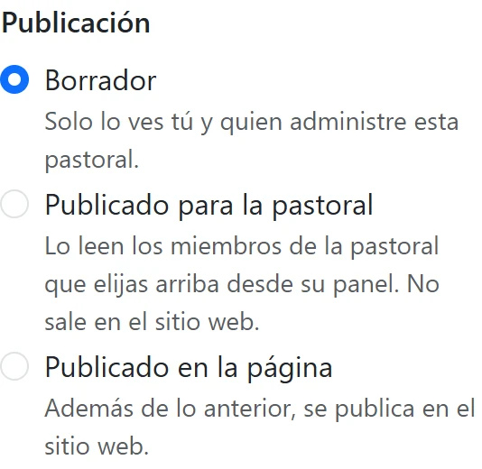
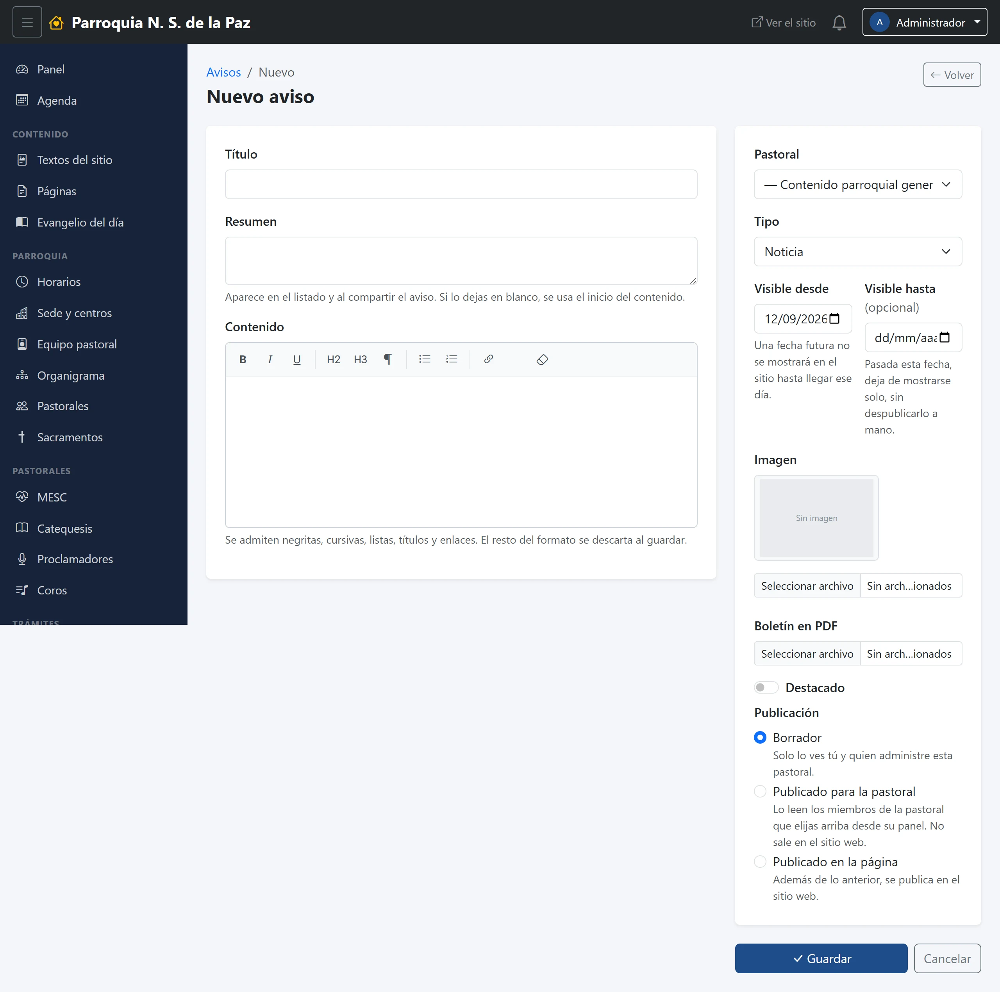

# 5. Avisos

Un aviso es un texto que la parroquia o una pastoral quiere que alguien lea:
el boletín de la semana, la convocatoria a una reunión, la noticia de que ya
abrieron las inscripciones. Es el módulo que más se usa y el que conviene
entender bien, porque **publicar un aviso no es una sola cosa**: se puede
publicar para adentro, para la propia gente de la pastoral, o para todo el
mundo en el sitio web.

**Menú:** Comunicación → Avisos.

## El listado

Los filtros de arriba son los del capítulo 3 —*Todos*, *Borradores*, *De la
pastoral*, *En la página*— y se combinan con el selector de **Pastoral** de la
derecha. Cada renglón dice el título, de qué pastoral es, el tipo, la fecha y
en qué escalón va.

Con el botón azul **Nuevo aviso** se empieza uno.

## Los tres escalones de publicación

Es lo primero que hay que tener claro, y está abajo a la derecha del
formulario, bajo el título **Publicación**:

1. **Borrador.** Solo lo ves tú y quien administre esa pastoral. Sirve para
   dejarlo a medias y volver mañana.
2. **Publicado para la pastoral.** Lo leen los miembros de la pastoral que
   elegiste, desde su panel: les aparece en su pantalla de inicio y les suena
   la campana. **No sale en el sitio web.**
3. **Publicado en la página.** Además de lo anterior, se publica en el sitio,
   donde lo ve cualquiera.

Son excluyentes y van en ese orden: no existe «en la página pero no para la
pastoral». Por eso son tres opciones y no dos palomitas sueltas.

**Si tu cuenta no puede publicar en el sitio**, el tercer escalón no aparece;
en su lugar, el formulario te dice que para que salga en la página hace falta
que lo publique un editor. No es un botón desactivado que hay que adivinar: es
una frase que explica qué sigue.

## El formulario

A la izquierda va el texto; a la derecha, todo lo que decide dónde y cuándo
aparece.

### Lo que se lee

- **Título.** Obligatorio. Es lo que se ve en el listado, en la tarjeta del
  sitio y en la campana.
- **Resumen.** Dos renglones. Es lo que aparece debajo del título en el listado
  y al compartir el aviso. Si lo dejas en blanco, el sistema toma el principio
  del contenido, así que no es obligatorio pero casi siempre queda mejor
  escribirlo.
- **Contenido.** El aviso completo, con el editor de texto: negritas, listas,
  enlaces.

### Lo que decide dónde aparece

- **Pastoral.** De quién es el aviso. Si administras una sola, va fija y ni
  siquiera la eliges. Si administras varias, se escoge de la lista. Y quien
  puede publicar contenido de toda la parroquia tiene además la opción
  **«Contenido parroquial general»**, que es un aviso sin dueño: de la
  parroquia, no de una pastoral.
- **Tipo.** Tres opciones, y **no son solo una etiqueta**:
  - **Noticia**, lo ordinario.
  - **Boletín**, que además admite adjuntar el PDF.
  - **Comunicado**, que es el que cambia las cosas: va dirigido a **toda la
    parroquia**, sea de la pastoral que sea, así que lo leen también las demás
    —la coordinadora de Coros ve el comunicado de MESC, con el nombre de quien
    lo publica—.

  > **Comunicado no es lo mismo que dejar la pastoral vacía.** Dejarla vacía
  > significa «un aviso de la parroquia, sin dueño». Un comunicado es «un aviso
  > **de** esta pastoral **para** todos», y el panel lo muestra con su nombre.

- **Visible desde.** La fecha a partir de la cual se muestra. Si pones una
  fecha futura, el aviso espera a ese día para aparecer en el sitio; sirve para
  dejar preparado el boletín del domingo.
- **Visible hasta.** La fecha en que deja de mostrarse, **solo, sin que nadie
  tenga que despublicarlo**. Es el campo que más trabajo ahorra: la
  convocatoria de un curso que ya cerró se retira sola. En el listado, lo que
  ya pasó de esa fecha aparece marcado como *Vencido*, y deja de contar en la
  campana aunque nadie lo haya abierto.

### Lo demás

- **Imagen.** La foto de la tarjeta, en el listado del sitio y en el tablón del
  panel. Si no pones ninguna, se dibuja un fondo con el título.
- **Boletín en PDF.** Solo para los de tipo boletín: el archivo que la gente
  descarga. Al editar aparece un enlace para verlo y una palomita para
  quitarlo.
- **Destacado.** Lo sube en las listas y lo marca con su insignia. Conviene
  usarlo con cuentagotas: si todo está destacado, nada lo está.

Al terminar, **Guardar**. Se vuelve al listado con el aviso en el escalón que
hayas elegido.

## Qué pasa después de publicar

Según el escalón:

- **Para la pastoral:** a cada miembro de esa pastoral le aparece en su
  pantalla de inicio, en el tablón «De tus pastorales», marcado como **Nuevo**
  hasta su siguiente ingreso, y le suma uno a la campana hasta que lo abra. Si
  la pastoral es una **comisión**, les llega también a las pastorales que
  agrupa.
- **En la página:** además de lo anterior, sale en la sección Avisos del sitio
  y, si es de los más recientes, en la portada.

## Leer un aviso

Desde el listado, el botón del ojo abre el aviso completo, con su imagen, su
estado y, si ya está en el sitio, un enlace para verlo ahí. Abrirlo es lo que
lo marca como leído para ti: baja tu contador de la campana y no vuelve a
subir.

## Cambiar o quitar un aviso

- **El lápiz** abre el mismo formulario. Cambiar el escalón a *Borrador*
  retira el aviso del sitio sin borrarlo.
- **El bote de basura** lo borra de verdad, y pregunta antes. Si solo quieres
  que deje de verse, es mejor bajarlo a borrador o ponerle una fecha de
  «visible hasta»: el aviso sigue ahí para consultarlo después.
