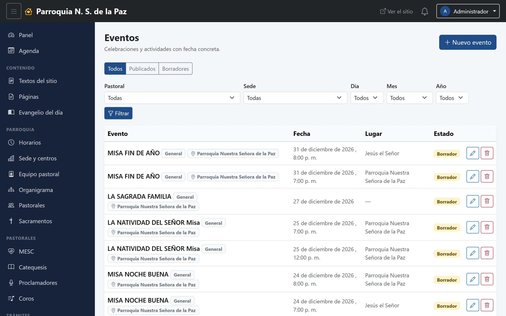
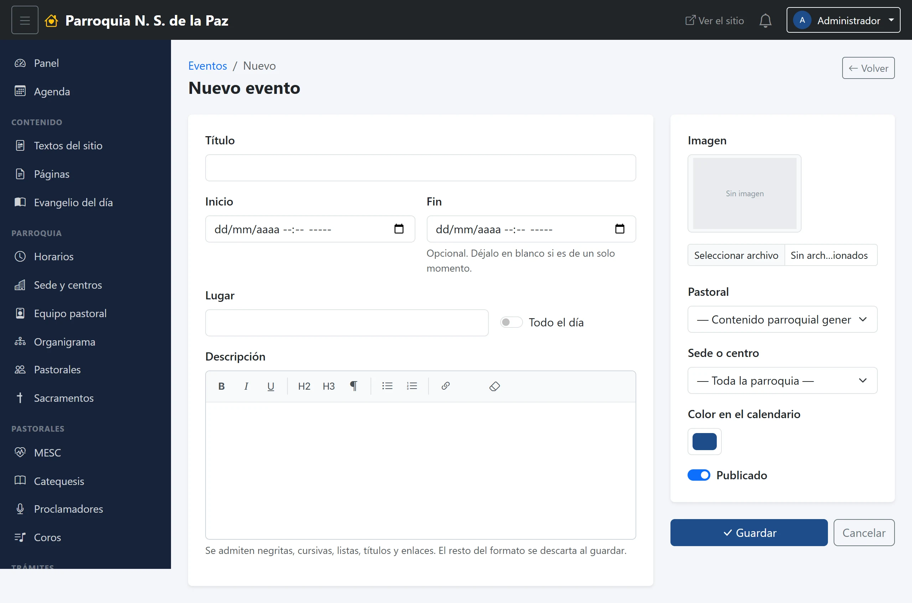

# 6. Eventos

Un evento es algo que pasa un día y a una hora: la posada, el retiro de
Adviento, la reunión mensual de una pastoral. Van al calendario del sitio y,
publicados o no, a la agenda interna del equipo.

**Menú:** Comunicación → Eventos.

## El listado

Como el de avisos, pero con **más filtros, y todos se combinan**:

- **El estado**, en la fila de botones: *Todos*, *Publicados*, *Borradores*.
- **La pastoral** y **la sede**, cada una en su selector.
- **Día, mes y año**, en tres selectores sueltos. Son los que más se usan: la
  agenda de la parroquia tiene cientos de eventos cargados, y casi siempre se
  busca «lo de este mes». Se eligen y se pulsa **Filtrar**.

Cada renglón dice el título —con la pastoral y la sede en dos etiquetas
debajo—, la fecha con su hora, el lugar y el estado. A la derecha, el lápiz
para editar y el bote para borrar. Con el botón azul **Nuevo evento** se crea
uno.

## El formulario

### Cuándo y dónde

- **Título.** Obligatorio.
- **Inicio.** Fecha **y hora**. Es el único dato de tiempo obligatorio.
- **Fin.** Opcional. Se deja en blanco si el evento es de un solo momento; se
  llena cuando dura un rato, o varios días.
- **Todo el día.** Para lo que no tiene hora —una jornada, un día de campo—.
  Con esta palomita el calendario deja de mostrar la hora.
- **Lugar.** Texto libre: «Salón parroquial», «Templo», «Casa de retiros». Es
  distinto de la sede: la sede dice a qué comunidad pertenece el evento, el
  lugar dice dónde se junta la gente.
- **Descripción.** Con el editor de texto, para los detalles.

> **Un evento de varios días se marca en todos sus días.** Si pones inicio el
> viernes y fin el domingo, aparece el viernes, el sábado y el domingo, no solo
> el primer día. Es lo que se espera de un retiro o de un triduo.

### De quién es

- **Pastoral.** Igual que en avisos: si administras una sola, va fija; si
  varias, se elige; y quien puede publicar de toda la parroquia tiene además
  **«Contenido parroquial general»**.
- **Sede o centro.** En qué comunidad ocurre. Se puede dejar en **«Toda la
  parroquia»** cuando no es de una sede en particular. Este dato es el que
  permite que el calendario del sitio se pueda filtrar por comunidad.
- **Imagen.** La foto de la tarjeta en el sitio.
- **Color en el calendario.** El color con el que se dibuja su casilla, tanto
  en el calendario del sitio como en la agenda interna. Sirve para distinguir
  de un vistazo lo de una pastoral, o para separar lo ordinario de lo
  extraordinario. Si no lo tocas, va el azul de la casa.

### Publicar

Los eventos **no tienen los tres escalones de los avisos**: llevan un solo
interruptor, **Publicado**, con dos posiciones. Apagado es borrador —lo ve el
equipo en la agenda interna, nadie más—; encendido sale en el calendario del
sitio.

Si tu cuenta no puede publicar, el interruptor no aparece: lo que captures
queda en borrador hasta que alguien con permiso lo publique.

## Dónde acaba

- **En el sitio**, en la sección Eventos, con sus cuatro vistas —día, semana,
  mes y año— y en la portada, entre los próximos eventos.
- **En la agenda interna** del panel, publicado o no, junto a los cursos y
  junto a lo de las demás pastorales. Eso es el capítulo 8.

## Cambiar o quitar un evento

El lápiz abre el formulario; apagar **Publicado** lo retira del sitio sin
borrarlo, y el bote de basura lo elimina, preguntando antes.

Para algo que se repite todas las semanas —la misa, la hora santa, el ensayo
del coro— **no se capturan eventos uno por uno**: eso son horarios, y viven en
Parroquia → Horarios, que es el capítulo 11.
