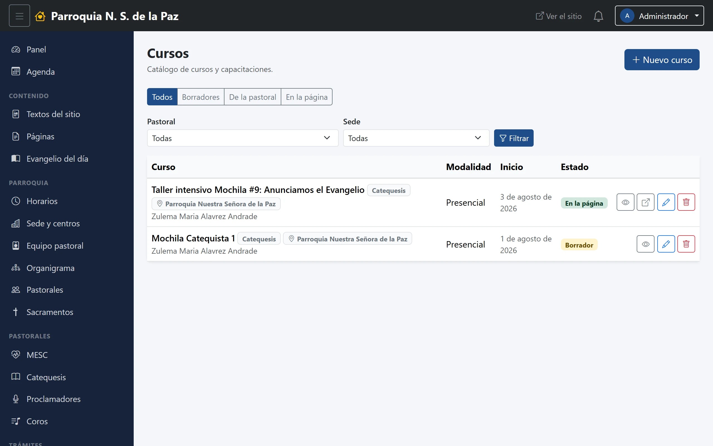
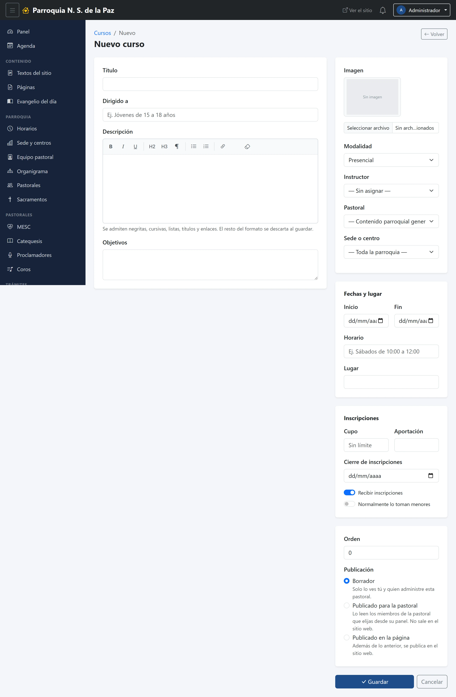
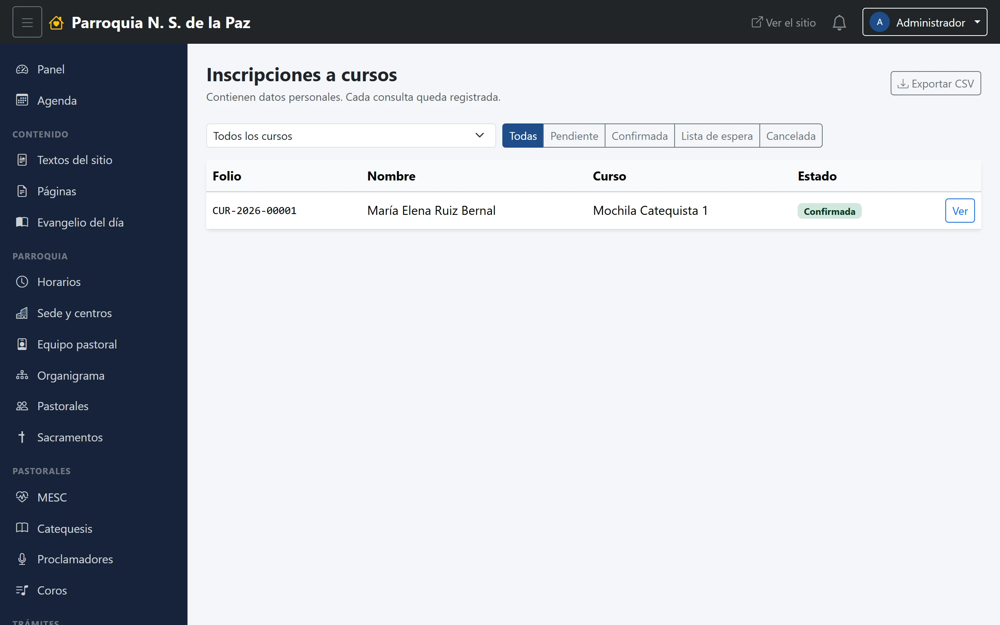
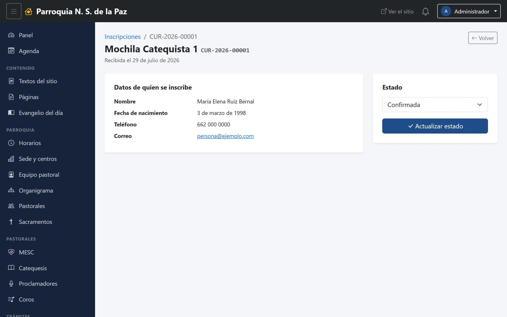

# 7. Cursos e inscripciones

Un curso es una formación con fechas, cupo y gente apuntada: el taller de
catequistas, la preparación para el bautismo, un ciclo de pláticas. Se publica
como cualquier otra cosa, pero tiene algo que los demás módulos no tienen:
**recibe inscripciones desde el sitio**, y esas inscripciones son datos
personales de gente que confió en la parroquia. Este capítulo trata las dos
mitades.

**Menú:** Comunicación → Cursos, y Trámites → Inscripciones.

## El listado de cursos

Los mismos filtros de siempre —estado, pastoral y sede— y, en cada renglón, el
título del curso, su modalidad, cuándo inicia y en qué escalón está.

## El formulario

Es el formulario más largo del panel, pero está partido en cuatro bloques que
se entienden solos.

### De qué se trata

- **Título.** Obligatorio.
- **Dirigido a.** Una línea que dice a quién va: «Jóvenes de 15 a 18 años»,
  «Papás y padrinos». Sale en la tarjeta del sitio y ayuda a que no se apunte
  quien no debe.
- **Descripción** y **Objetivos.** El detalle, con el editor de texto.

### Cómo se da

- **Imagen**, la foto de la tarjeta.
- **Modalidad**: *Presencial*, *En línea* o *Mixta*. Sale como etiqueta en el
  sitio.
- **Instructor.** Se elige del equipo pastoral, no se escribe a mano —igual que
  el responsable de una pastoral—, así que el nombre se mantiene al día solo.
  Puede quedar **sin asignar**.
- **Pastoral** y **Sede o centro**, como en avisos y eventos.

### Fechas y lugar

- **Inicio** y **Fin**: solo la fecha, sin hora.
- **Horario**, en texto libre: «Sábados de 10:00 a 12:00». Se escribe así
  porque un curso rara vez cabe en una hora exacta, y esta línea es la que la
  gente lee.
- **Lugar**, también libre.

### Inscripciones

Este bloque es el que decide si el curso recibe gente o solo se anuncia:

- **Recibir inscripciones.** El interruptor principal. Apagado, el curso se
  publica como información y no aparece el formulario en el sitio.
- **Cupo.** Cuántos lugares hay. Si se deja vacío, dice *Sin límite*. **Cuando
  el cupo se llena, las inscripciones que sigan llegando entran solas como
  «lista de espera»**: no se pierden ni se rechazan, quedan apuntadas para
  cuando alguien cancele.
- **Aportación.** Texto libre, para decir cuánto se coopera y cómo.
- **Cierre de inscripciones.** La fecha a partir de la cual el formulario deja
  de aceptar gente.
- **Normalmente lo toman menores.** Con esto encendido, el formulario del sitio
  pide además los datos del tutor. Es el interruptor que hay que recordar en
  los cursos de niños y adolescentes.

### Orden y publicación

- **Orden** coloca el curso dentro de la lista del sitio; los de número más
  bajo salen primero.
- **Publicación** son **los mismos tres escalones de los avisos** —borrador,
  para la pastoral, en la página—, con el mismo significado. El capítulo 5 los
  explica a fondo.

## El temario, después de guardar

Un curso puede llevar su lista de **sesiones**: número, fecha, título y
descripción de cada clase. Esa parte **solo aparece cuando el curso ya está
guardado**, debajo de la descripción: se agregan de una en una con el botón de
arriba, y cada una se edita desde su propio renglón. Es a propósito —un curso
sin guardar todavía no tiene a qué colgarle las sesiones—, así que el orden de
trabajo es: llenar el curso, guardar, y entonces capturar el temario.

## Las inscripciones

Cuando alguien se apunta desde el sitio, su inscripción llega aquí con un
**folio** —`CUR-2026-00001`—, que es lo que se le dice a la persona por
teléfono para identificar su trámite. No se manda ningún correo: se atiende
desde esta pantalla.

Arriba hay dos filtros, el **curso** y el **estado**, y un botón para
**exportar a CSV** lo que esté filtrado, que se abre en Excel.

### Los cuatro estados

| Estado | Qué significa |
|---|---|
| **Pendiente** | Acaba de llegar; nadie la ha revisado |
| **Confirmada** | Tiene su lugar |
| **Lista de espera** | Llegó con el cupo lleno; entra si alguien cancela |
| **Cancelada** | Se dio de baja |

### Una inscripción por dentro

Con **Ver** se abre el expediente: el curso y el folio arriba, cuándo se
recibió, y los datos de quien se inscribe —nombre, fecha de nacimiento,
teléfono, correo y las notas que haya escrito—. Si es menor de edad, aparece
marcado como tal y con una segunda tarjeta con los datos de su tutor.

A la derecha se cambia el estado y se guarda con **Actualizar estado**. Es lo
que se hace al confirmarle el lugar a alguien o al darlo de baja.

## Lo que hay que cuidar

Estos datos —y los mensajes de contacto— son los únicos datos personales de
fuera que guarda el sistema, y algunos son de menores. Tres reglas que no son
del programa sino de la parroquia:

- **No salen del panel.** No se publican, ni completos ni en resumen; el
  listado no es para pasarlo por WhatsApp.
- **El archivo exportado es el eslabón débil.** Un CSV en la carpeta de
  Descargas de una computadora compartida es una lista de nombres, teléfonos y
  fechas de nacimiento al alcance de cualquiera. Se exporta para un trabajo
  concreto y se borra al terminar.
- **Solo quien tiene que verlos.** Por eso Secretaría es un rol aparte: quien
  atiende la oficina necesita estos dos módulos y nadie más los ve. Ni
  siquiera el Editor, que puede tocar todo el contenido del sitio.

Lo que el sistema garantiza por su cuenta es que nadie se inscribe sin haber
aceptado el aviso de privacidad, y que queda guardado **a qué versión del
aviso** dijo que sí.
