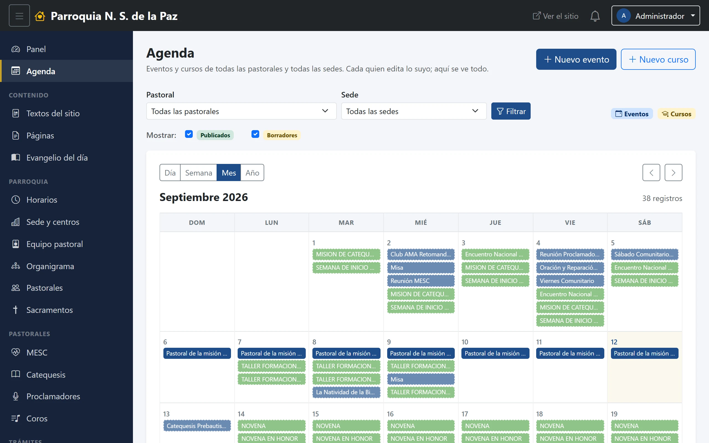
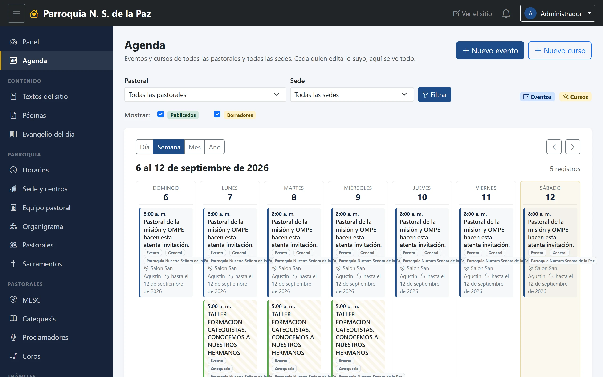

# 8. Agenda

La agenda es el calendario del equipo. No es el del sitio: ese enseña lo
publicado, y este enseña **todo lo que hay**, para que dos pastorales no
acaben ocupando el mismo salón el mismo sábado.

**Menú:** Agenda, hasta arriba, debajo del Panel.

## En qué se distingue del calendario del sitio

Dos cosas, y las dos son la razón de que exista:

1. **Junta eventos y cursos**, y los muestra **estén publicados o no**. Lo que
   todavía es borrador es justamente lo que hay que coordinar: un retiro a
   medio planear ya ocupa el salón aunque nadie lo haya publicado.
2. **Todas las pastorales y todas las sedes se ven entre sí.** Esta pantalla no
   recorta nada por el alcance de tu cuenta: aquí ves lo de todos.

Eso último suele sorprender, y conviene decirlo con claridad: **el alcance
decide qué puedes *tocar*, no qué puedes *mirar*.** En los listados de eventos
y cursos cada quien trabaja sobre lo suyo; aquí se coordina, y para coordinar
hay que ver el calendario completo. El lápiz para editar solo aparece sobre lo
que sí es tuyo.

## Cómo se lee

**Las cuatro vistas** —*Día*, *Semana*, *Mes*, *Año*— se cambian con los
botones de arriba a la izquierda, y las flechas de la derecha mueven al periodo
anterior o siguiente. Al lado del nombre del periodo se dice cuántos registros
tiene: son registros, no días ocupados, así que un curso de tres meses cuenta
como uno aunque se pinte en noventa casillas.

**Los colores.** La leyenda de la derecha lo resume: azul para los eventos,
dorado para los cursos. Un evento al que se le puso color propio en su
formulario se dibuja con ese color, que es para lo que sirve ese campo.

**Los borradores van con el borde punteado.** Es la diferencia visual entre
«esto ya está anunciado» y «esto todavía se está cocinando».

## Los filtros

Arriba hay dos selectores, **Pastoral** y **Sede**, y el botón **Filtrar**.
Aquí son una comodidad, no un permiso: sirven para quedarse con lo de una
comunidad cuando el mes viene cargado, no para esconderte nada.

Debajo, **Mostrar: Publicados / Borradores** son dos palomitas que ocultan y
muestran sin recargar la página. Sirven para mirar la semana «como la ve la
gente» y volver a la vista completa de un clic.

## Trabajar desde aquí

Los dos botones de arriba a la derecha, **Nuevo evento** y **Nuevo curso**,
llevan a los formularios de los capítulos 6 y 7. Es el camino natural: se mira
el mes, se ve el hueco, se captura ahí mismo.

Y al hacer clic en una casilla se abre directamente el formulario de ese evento
o de ese curso, listo para cambiarlo. **Solo las casillas que puedes editar son
enlaces**: lo de las demás pastorales se ve, con su nombre y su hora, pero no
lleva a ninguna parte. Es la misma idea de antes —mirar todo, tocar lo tuyo—,
esta vez en la forma del cursor.

## Un aviso al pie

Debajo del calendario aparece a veces una nota con los **cursos sin fecha de
inicio**. Un curso sin fecha no cabe en ninguna casilla, y en vez de
desaparecerlo en silencio, la agenda lo enumera ahí para que alguien le ponga
fecha.
