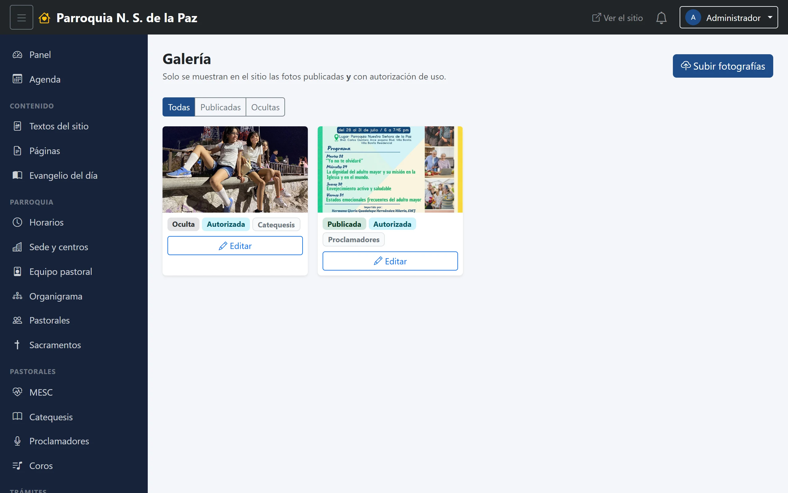
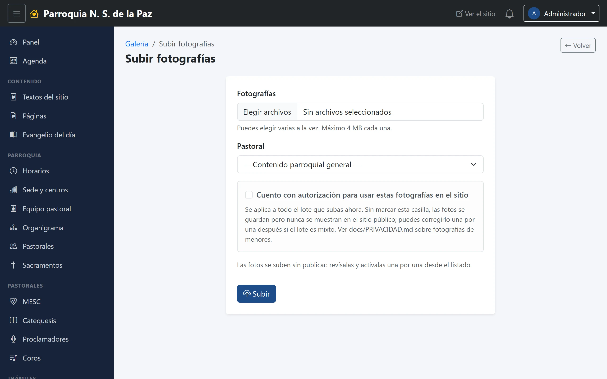
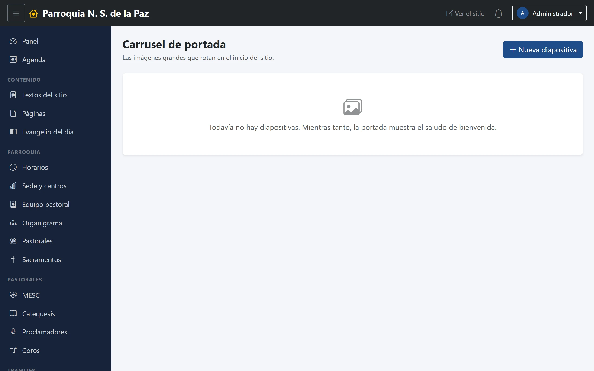

# 9. Galería y carrusel

Dos módulos pequeños que trabajan con fotografías y se confunden con
facilidad, porque los dos «suben fotos al sitio». La diferencia es dónde
acaban:

- **La galería** es el álbum de la parroquia, en su propia sección del sitio.
- **El carrusel** son las fotos grandes que pasan solas en la portada.

**Menú:** Comunicación → Galería y Comunicación → Carrusel.

## La galería

Las fotos se ven en cuadrícula, cada una con sus etiquetas. Arriba, los filtros
*Todas*, *Publicadas* y *Ocultas*, y el botón azul **Subir fotografías**.

Cada foto lleva hasta cuatro etiquetas, y conviene leerlas juntas:

| Etiqueta | Qué dice |
|---|---|
| **Publicada** / **Oculta** | Si se ve en el sitio o no |
| **Autorizada** / **Sin autorizar** | Si hay permiso de las personas que salen |
| *(nombre de pastoral)* | De quién es la foto |

Al hacer clic en una foto se abre su ficha, donde se le pone **título** y
**texto alternativo** —la descripción que leen quienes usan lector de
pantalla—, y se cambian los dos interruptores.

### Subir fotos

Se pueden elegir **varias a la vez**, hasta 4 MB cada una, en JPG, PNG, WebP o
GIF. Se indica de qué pastoral son y se sube el lote entero de una vez.

### La palomita que no hay que pasar por alto

> **«Cuento con autorización para usar estas fotografías en el sitio»**

Es la casilla más importante del módulo, y el sistema la toma en serio: **sin
marcarla, las fotos se guardan pero nunca se muestran en el sitio público.** No
se pierden ni hay que volver a subirlas: quedan ahí, marcadas como *Sin
autorizar*, y se pueden ir autorizando una por una cuando el lote es mixto.

Vale la pena decir por qué existe. Una foto de una posada o de una primera
comunión es una fotografía de personas identificables, muchas veces de menores,
y publicarla en internet requiere permiso de quien aparece —de sus padres, si
son niños—. La casilla es el sitio donde esa responsabilidad se hace explícita:
quien sube las fotos declara que ese permiso existe.

## El carrusel

Son las imágenes grandes del encabezado de la portada. Si no hay ninguna
visible, la portada dibuja en su lugar el nombre de la parroquia sobre el fondo
azul —que es lo que se ve hoy—; en cuanto hay una, empiezan a pasar solas.

Cada diapositiva lleva:

- **Imagen.** Conviene que sean apaisadas y de buena resolución: se ven a todo
  lo ancho de la pantalla.
- **Título** y **subtítulo**, el texto que se dibuja encima.
- **Enlace**, opcional: a dónde lleva al hacerle clic —un curso, un aviso, una
  página—.
- **Orden**, para decidir en qué secuencia pasan.
- **Visible**, el interruptor que la saca o la mete sin borrarla. Es lo que se
  usa para guardar la diapositiva de la fiesta patronal hasta el año que viene.
