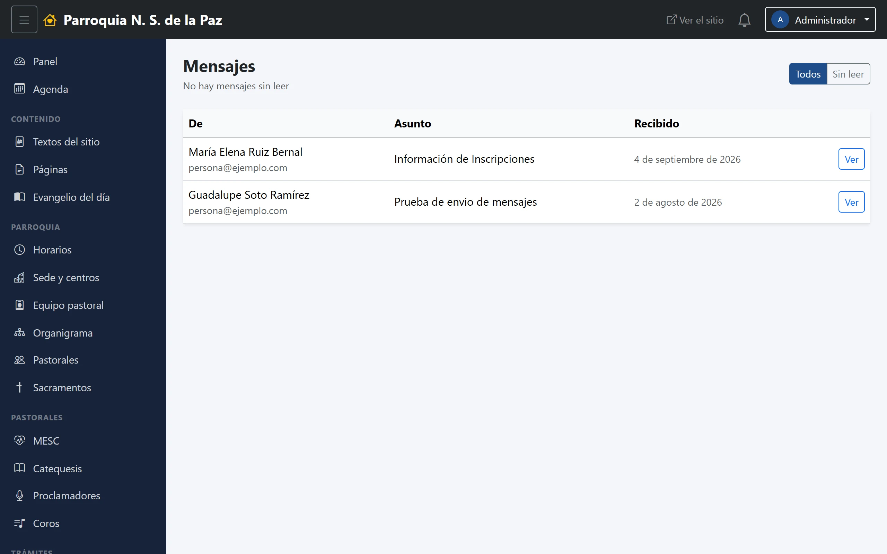
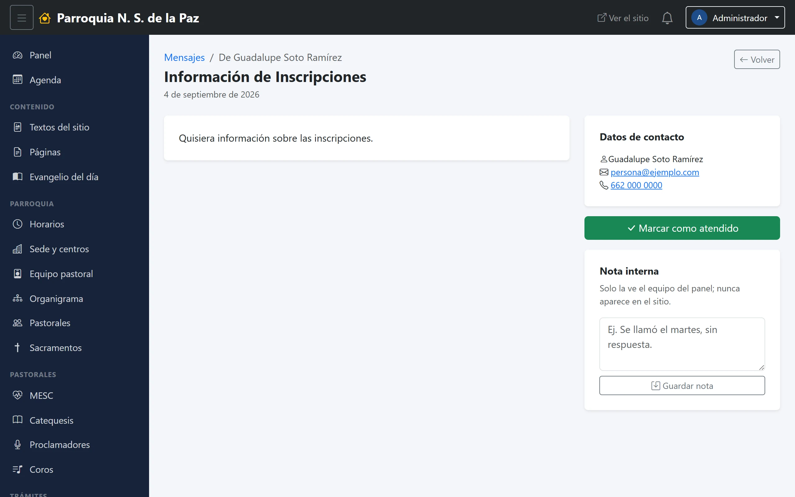

# 10. Mensajes de contacto

Aquí llega lo que la gente escribe por el formulario de la página de Contacto.
No se reenvía a ningún correo: **el buzón es esta pantalla**, y si nadie entra,
nadie contesta.

**Menú:** Comunicación → Mensajes.

Solo lo ven el **Administrador** y **Secretaría**. Ni siquiera el Editor, que
puede tocar todo el contenido del sitio, entra aquí: lo que se guarda son datos
personales de alguien de fuera de la parroquia.

## El listado

Dos filtros, *Todos* y *Sin leer*, y una tabla con quién escribe, el asunto y
cuándo llegó. **Los que nadie ha abierto vienen en negrita y con un punto de
color**; son los mismos que cuenta la campana de la barra.

## Un mensaje por dentro

Con **Ver** se abre. A la izquierda, el mensaje tal como lo escribió la
persona. A la derecha, tres cosas:

**Datos de contacto.** Su nombre y la forma de responderle: el correo es un
enlace que abre el programa de correo, y el teléfono, uno que marca desde el
celular. El formulario obliga a dejar al menos uno de los dos, así que siempre
hay por dónde contestar.

**Marcar como atendido.** El botón verde. No cambia nada para quien escribió
—no se le manda ningún aviso—: es para el equipo, y deja registrado **quién**
lo atendió, que es lo que evita que dos personas contesten lo mismo o que nadie
conteste creyendo que ya lo hizo otro.

**Nota interna.** Un renglón para dejar dicho lo que pasó: «se llamó el martes,
sin respuesta», «se le mandó el formato por correo». **Solo la ve el equipo del
panel; nunca aparece en el sitio** ni se le manda a quien escribió.

## Cómo se trabaja

No hay reglas del sistema aquí, pero sí una forma que funciona:

1. Se abre el mensaje, que con eso deja de contar en la campana.
2. Se responde por donde la persona dejó su dato.
3. Se apunta en la nota interna qué se hizo.
4. Se marca como atendido.

Un mensaje abierto pero no atendido es el caso peligroso: ya no aparece como
sin leer y todavía no ha respondido nadie. Por eso conviene marcarlo atendido
solo cuando de verdad se cerró.

## Sobre borrarlos

Los mensajes se pueden eliminar, y **conviene hacerlo**: son datos personales
de alguien que escribió para preguntar algo, y una vez resuelto no hay razón
para conservarlos indefinidamente.

El sistema **no los borra solo**. No hay una limpieza automática por
antigüedad, así que la única depuración que va a ocurrir es la que alguien haga
a mano cada cierto tiempo. Es la misma advertencia que el capítulo 7 hace sobre
las inscripciones a cursos.
