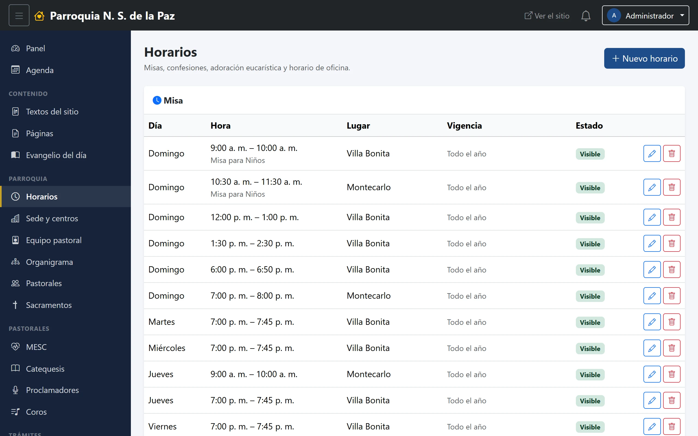
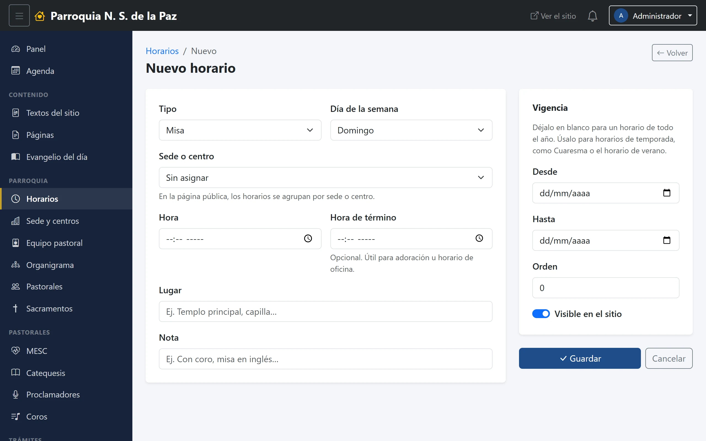
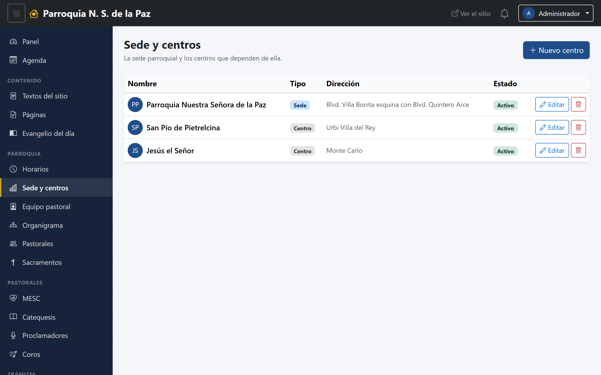

# 11. Horarios y sedes

La parroquia no es un solo templo: tiene su sede y varios centros, y cada uno
con sus misas. Estos dos módulos son los que sostienen eso.

**Menú:** Parroquia → Horarios y Parroquia → Sede y centros.

## Horarios

Aquí va **lo que se repite todas las semanas**: las misas, las confesiones, la
adoración, el horario de oficina. Lo que ocurre una sola vez —un retiro, una
posada— no es un horario, es un evento (capítulo 6).

### El formulario

- **Tipo.** *Misa*, *Confesión*, *Adoración eucarística*, *Oficina parroquial*
  u *Otro*. En la página pública los horarios se agrupan por este campo, con
  las misas arriba.
- **Día de la semana.**
- **Sede o centro.** En cuál de los templos. El sitio los agrupa también por
  esto, y es lo que hace funcionar el filtro «Ver horarios de» de la página
  pública.
- **Hora** y **Hora de término.** La segunda es opcional; se usa para lo que
  dura un rato, como la adoración o la oficina.
- **Lugar** y **Nota**, los dos en texto libre: «capilla del Santísimo»,
  «excepto el primer viernes».

### Los horarios de temporada

A la derecha hay dos fechas, **Desde** y **Hasta**, bajo el título *Vigencia*.
En blanco, el horario vale todo el año, que es el caso normal.

Se llenan para lo que solo dura una temporada: el horario de Cuaresma, las
misas de verano, la novena de la fiesta patronal. Fuera de esas fechas el
horario deja de mostrarse **solo**, y vuelve al año siguiente si se cambian las
fechas. Es la alternativa a acordarse de dar de baja y de alta cada año.

## Sedes y centros

El catálogo de los lugares de la parroquia. Cada uno tiene:

- **Nombre** y **Tipo**: *Sede* o *Centro*. La sede es la parroquia; los
  centros, las comunidades que dependen de ella.
- **Dirección** y **Teléfono**.
- **Descripción**, para lo que convenga decir de ese lugar.
- **Orden**, que decide cómo se listan.
- **Activo**, el interruptor que lo saca de circulación sin borrarlo.

### Por qué este catálogo importa más de lo que parece

Es pequeño —tres o cuatro renglones— pero lo usa medio sistema:

- **Los horarios** se agrupan por sede, y el sitio permite filtrar por ella.
- **Los eventos y los cursos** guardan en qué sede ocurren.
- **Las cuentas de usuario** se acotan por sede: es la mitad del alcance que
  explica el capítulo 4, y es lo que distingue a las tres coordinadoras de
  catequesis —la de la parroquia, la de San Pío y la de Jesús el Señor— sin
  tener que duplicar la pastoral.
- **Las personas del equipo** se marcan en la sede donde sirven.

Por eso conviene no borrar un centro que ya está en uso: si deja de haber
actividad ahí, se apaga con **Activo** y todo lo que cuelga de él se queda
coherente.
