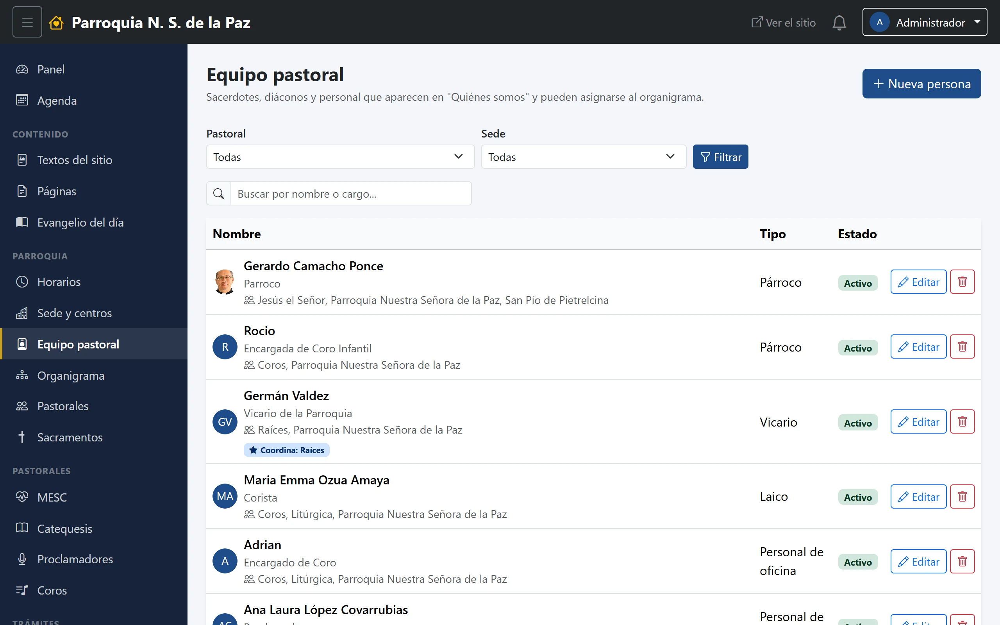
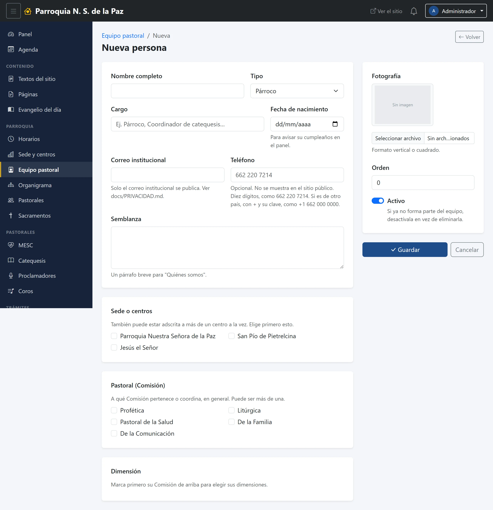
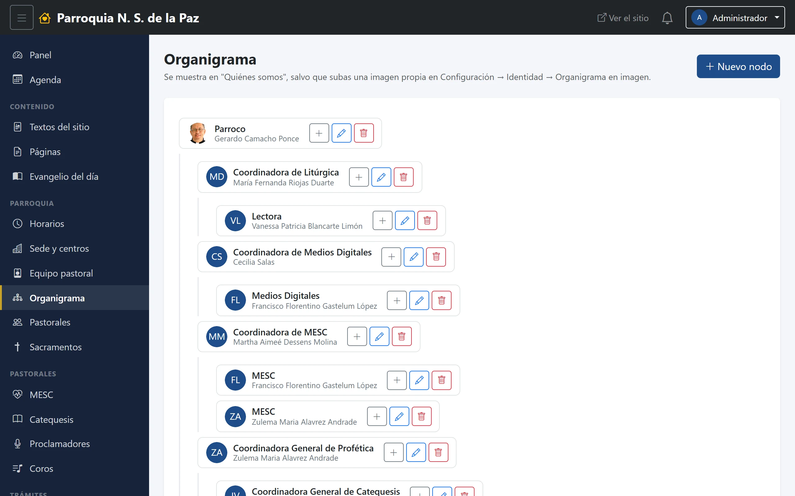

# 12. Equipo pastoral y organigrama

El equipo pastoral es **el catálogo de personas de la parroquia**, y es el
módulo del que más cosas dependen. Vale la pena entenderlo antes que los de las
pastorales con módulo propio, porque todos beben de aquí.

**Menú:** Parroquia → Equipo pastoral y Parroquia → Organigrama.

## Por qué este catálogo está en el centro

De estas fichas salen, sin volver a escribir el nombre de nadie:

- Quién aparece en **«Quiénes somos»** en el sitio.
- Quién **coordina cada pastoral**.
- Quién es **instructor** de un curso.
- Quién es **ministro de MESC, catequista, proclamador o corista**.
- **De quién es cada cuenta** del panel: al dar de alta un usuario se elige una
  persona del equipo, y de ahí vienen su nombre, su teléfono y su foto.
- Los **cumpleaños** que la pantalla de inicio avisa cada mes.

Todo eso existe porque el problema se encontró tres veces: la misma
coordinadora estaba escrita como «Zulema» en un catálogo, «Zulema Alvarez» en
otro y con su nombre completo en su ficha. Con una sola lista, el nombre se
corrige en un sitio y se corrige en todos.

## El listado

Un buscador por nombre o cargo, filtros por pastoral y por sede, y una tabla
con la foto, el nombre, el cargo, las pastorales y sedes de cada quien, su tipo
y si está activa. Quien coordina una pastoral lleva además una estrella que lo
dice.

## La ficha

- **Nombre completo.** El de verdad, completo: es el que se va a ver en todas
  partes.
- **Tipo.** Párroco, vicario, diácono, religioso o religiosa, laico, personal
  de oficina. Es lo que agrupa las fichas en «Quiénes somos».
- **Cargo.** Una línea: «Encargada de Coro Infantil», «Coordinadora de
  Catequesis».
- **Fecha de nacimiento.** Es lo que alimenta los cumpleaños del panel. **No se
  publica en el sitio**: solo se usa puertas adentro.
- **Correo institucional** y **Teléfono.** El correo institucional es el único
  que se publica; el teléfono es para uso del equipo —de ahí salen los botones
  de WhatsApp de los listados— y nunca aparece en el sitio.
- **Semblanza.** Un párrafo breve para «Quiénes somos».
- **Foto.**
- **Su pareja.** Se elige de la misma lista. Vale en toda la parroquia: es lo
  que permite que en Matrimonios, AMA, JECSA y Raíces coordine un matrimonio y
  no una persona suelta.
- **Sede o centros** y **Pastorales**, en dos listas de palomitas. Se puede
  pertenecer a varias de cada una.
- **Activa**, el interruptor de siempre.

> **Dar de alta a alguien aquí lo publica en el sitio.** Toda persona activa
> aparece en «Quiénes somos» con su nombre, su cargo, su foto y su semblanza.
> Para que deje de aparecer —alguien que dejó su encargo— se marca la ficha
> como inactiva; no hace falta borrarla, y conviene no hacerlo: su nombre puede
> estar todavía colgando del organigrama o de un catálogo.

## El organigrama

Es el árbol de la parroquia: quién depende de quién. Se arma con **nodos**, y
cada nodo tiene:

- **Título.** Lo que se dibuja en la cajita.
- **Depende de.** De qué nodo cuelga. Dejarlo vacío lo pone en la raíz.
- **Pastoral** y **Persona**, los dos opcionales: si se eligen, el nodo queda
  ligado a esa pastoral o a esa ficha, y el organigrama muestra el nombre al
  día sin tener que volver aquí cuando haya un relevo.
- **Orden entre sus iguales**, para colocarlo entre sus hermanos.
- **Visible en el sitio.**

En el sitio, el organigrama sale al final de «Quiénes somos», con un botón para
abrirlo en una **versión para imprimir**, en forma de árbol, que es la que se
usa cuando hace falta en papel.
