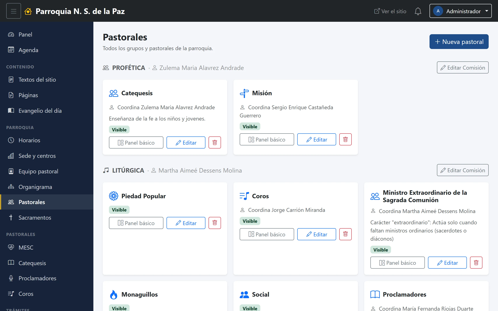
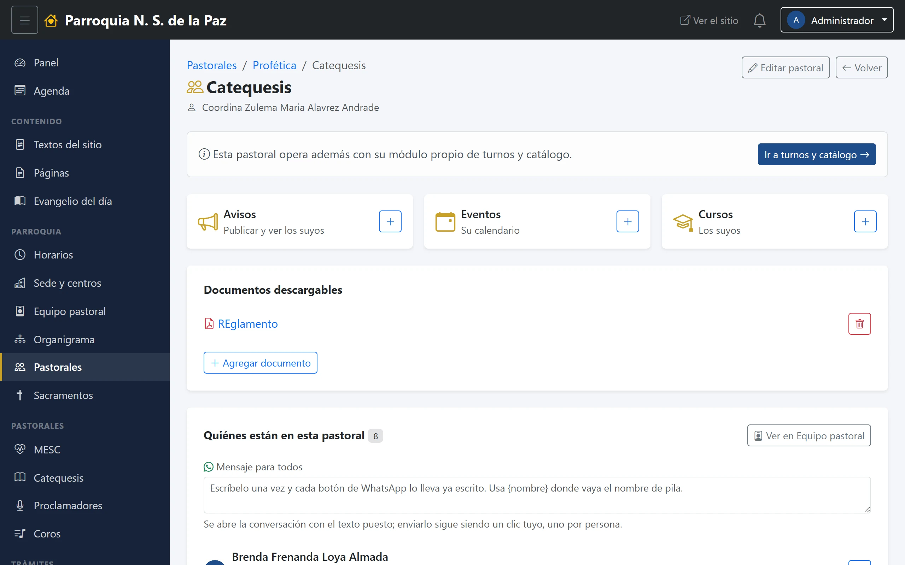

# 13. Pastorales

El catálogo de las pastorales de la parroquia y, para cada una, su ficha
pública y su panel de trabajo.

**Menú:** Parroquia → Pastorales.

## El listado

Las pastorales **se agrupan por comisión** —Litúrgica, Profética, De la
Familia, De la Comunicación, Pastoral de la Salud—, igual que en el sitio. Cada
tarjeta lleva el nombre, quién coordina y dos botones: **Panel básico** y
**Editar**.

Una **comisión** es una pastoral como cualquier otra, con su ficha y su
responsable; lo que la hace comisión es que otras la tienen marcada como su
«comisión padre». Y eso tiene una consecuencia práctica que conviene recordar:
quien coordina una comisión recibe también lo que publican hacia dentro las
pastorales que agrupa.

## La ficha

Se abre con **Editar**. Es la que alimenta la página pública de la pastoral.

### Identidad

- **Nombre** e **Icono** —una clase de Bootstrap Icons; el que se ve junto al
  nombre en el panel y en el sitio—.
- **Sede o centro** a la que pertenece.
- **Comisión padre.** Con qué comisión se agrupa. Vacío, la pastoral queda
  suelta.
- **Descripción breve**, la línea de la tarjeta del listado público, y el
  **contenido**, el texto largo de su página.

### Quién la lleva y cómo se le escribe

- **Responsable.** Se elige **del equipo pastoral**, no se escribe a mano. Si
  la persona elegida tiene pareja marcada en su ficha, la pastoral aparece
  coordinada por el matrimonio. Debajo hay un campo de nombre libre, que solo
  se usa si no eliges a nadie del equipo.
- **Correo de la pastoral** y **teléfono de contacto**. Se publican en su
  página. **El correo es de la pastoral, no de quien la coordina**: se escribe
  a mano a propósito, para que sobreviva a los relevos en vez de publicar el
  correo personal de quien esté al frente hoy.
- **Reunión**: día, hora y lugar. Es lo que la gente busca cuando quiere
  acercarse.
- **Acepta voluntarios**, una palomita que lo dice en su página.
- **Orden**, para colocarla dentro de su comisión.
- **Documentos**, que se suben aquí y se descargan desde su página.

## El panel básico

Es la pantalla de trabajo de la pastoral, y la que hace que una pastoral nueva
pueda operar **sin que nadie escriba una línea de código**. Tiene cuatro
partes:

**Los tres accesos**: Avisos, Eventos y Cursos, cada uno con un **+** para
crear uno nuevo ya asignado a esta pastoral. Es el atajo que evita tener que
acordarse de elegir la pastoral en el formulario.

**Documentos descargables.** Los mismos de la ficha, aquí a la mano: se agregan
y se quitan sin salir de esta pantalla. Son los que la gente baja desde la
página pública de la pastoral.

**Quiénes están en esta pastoral.** La lista de su gente, que sale del equipo
pastoral: alguien aparece aquí porque en su ficha está marcada esta pastoral.
Cada renglón lleva su botón de **WhatsApp**.

**Mensaje para todos.** Encima de la lista hay un cuadro de texto: se escribe
el aviso una vez —«recordatorio: reunión el jueves a las 7»— y cada botón de
WhatsApp abre la conversación de esa persona **con el texto ya puesto**.
Escribir `{nombre}` en el mensaje lo sustituye por el nombre de pila de cada
quien.

Dos cosas que conviene saber de ese cuadro: **enviar sigue siendo un clic tuyo,
uno por persona** —el sistema no manda nada solo—, y **el texto no se guarda en
ningún lado**: es un borrador del navegador, no un ajuste del sitio.

**Si la pastoral tiene módulo propio** —MESC, Catequesis, Proclamadores,
Coros—, arriba aparece un aviso con el botón **Ir a turnos y catálogo**, que
lleva a él. Esos módulos son los capítulos 15 a 18.

## Dar de alta una pastoral

Se crea desde el listado, se llena su ficha y, desde ese momento, **ya tiene su
panel básico**: sus avisos, sus eventos, sus cursos y sus documentos, sin más
trámite.

Lo que no ocurre solo es que aparezca como entrada propia en el menú lateral
del panel, junto a MESC o Catequesis. Eso hoy no se activa desde el panel: es
un cambio que hay que pedirle a quien lleva el sistema. La pastoral funciona
igual mientras tanto; se entra por Parroquia → Pastorales → Panel básico.
