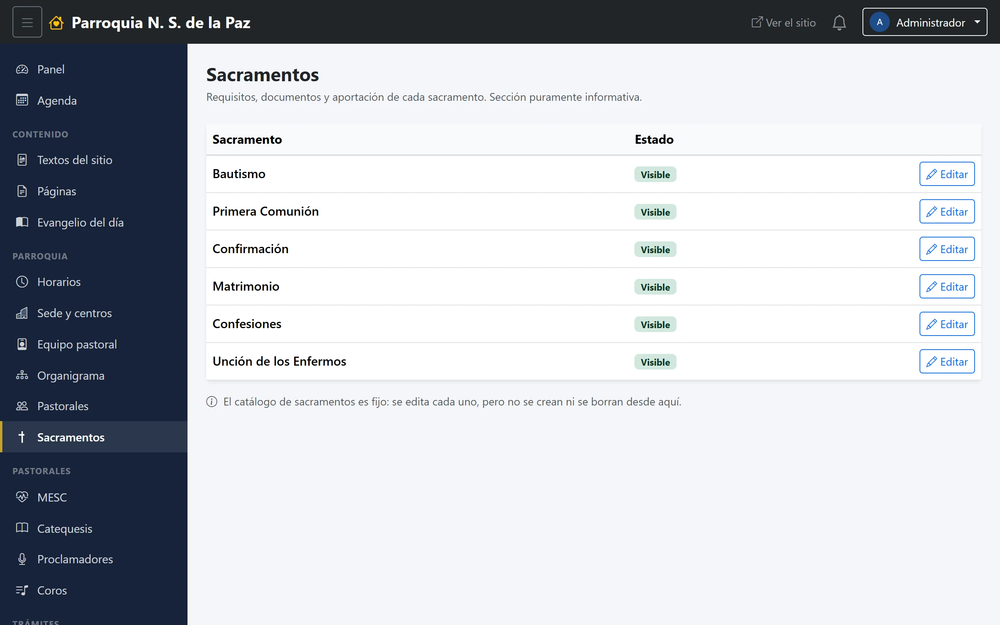

# 14. Sacramentos

La sección del sitio donde se dice qué hace falta para bautizar, para casarse o
para confirmar. Es el módulo más pequeño del panel y el que menos se toca: se
llena una vez y se corrige cuando cambia un requisito.

**Menú:** Parroquia → Sacramentos.

La lista viene ya con los sacramentos cargados; aquí no se dan de alta ni se
borran, se **editan**. Cada uno tiene:

- **Nombre.**
- **Descripción.** Un texto breve sobre el sacramento.
- **Requisitos.** Qué hace falta cumplir: pláticas, padrinos, edad.
- **Documentos a presentar.** La lista de papeles. Es lo que más se consulta y
  lo que evita el viaje en balde a la oficina.
- **Aportación.** Texto libre.
- **Orden**, para colocarlo en la página.
- **Visible en el sitio**, el interruptor que lo muestra o lo esconde.

Los tres textos largos se escriben con el editor, así que admiten listas y
negritas: una lista de documentos numerada se lee mucho mejor que un párrafo
corrido.

## No hay solicitud en línea

Conviene tenerlo claro porque a veces se pregunta: **el sitio no recibe
solicitudes de sacramentos.** Hubo un formulario y se retiró por decisión de la
parroquia; los trámites se hacen en la oficina.

Lo que esta sección hace, y hace bien, es que quien llegue a la oficina llegue
sabiendo qué llevar. Por eso vale la pena mantener los requisitos al día: cada
corrección aquí son varias vueltas que alguien se ahorra.
