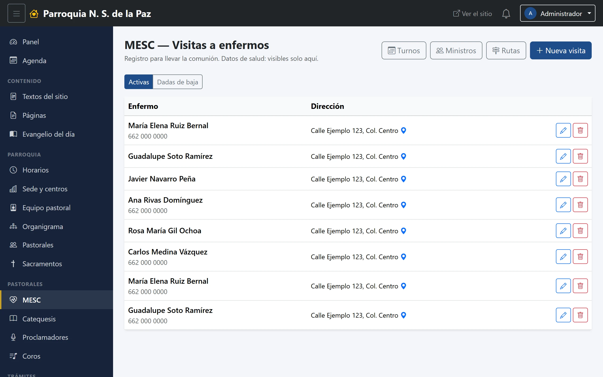
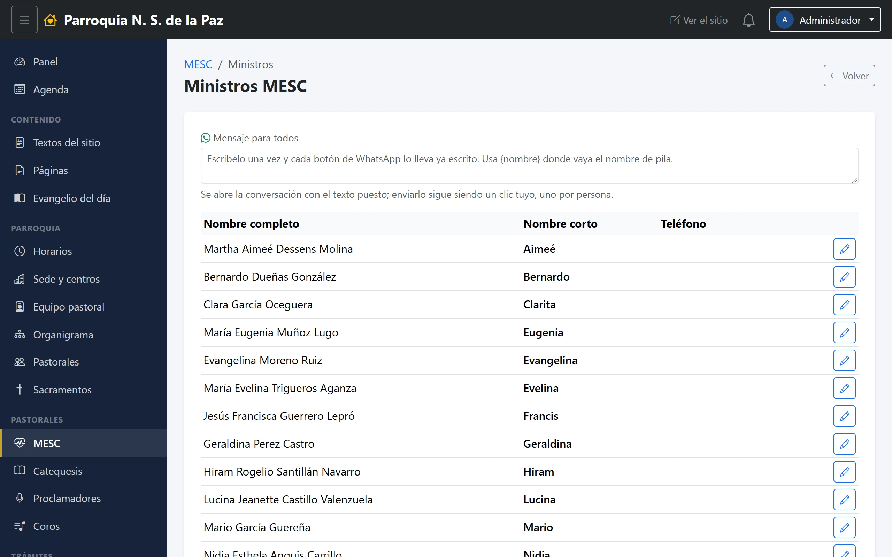
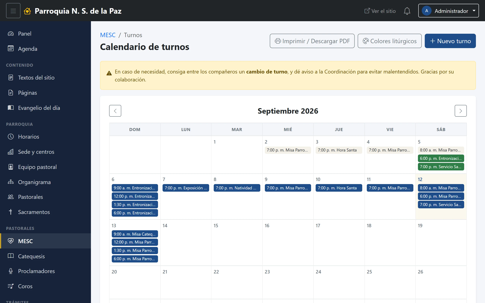
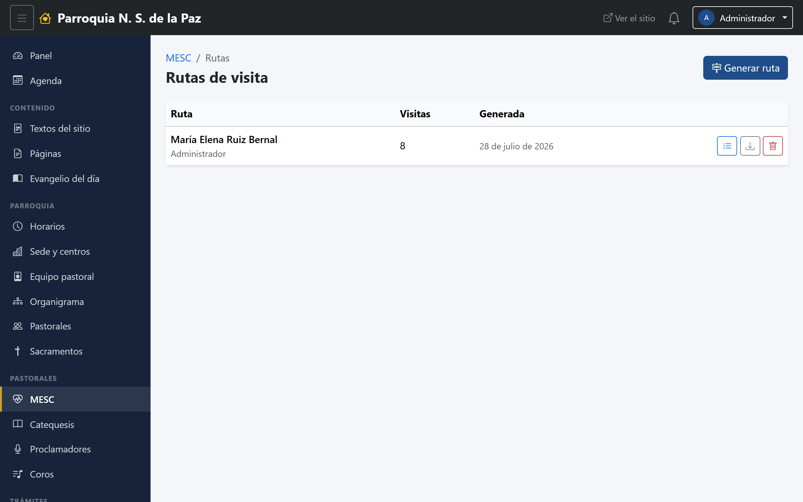

# 15. MESC — Ministros Extraordinarios de la Sagrada Comunión

El primero de los cuatro módulos que tienen pastorales concretas. MESC lleva
dos cosas a la vez: **quiénes son los ministros y cuándo sirve cada uno**, y
**a quién se le lleva la comunión a su casa**.

**Menú:** Pastorales → MESC.

Solo entran quienes administran esta pastoral, aunque el permiso de «ver MESC»
lo tengan todos los coordinadores: hay que administrar **esta** pastoral en
concreto. El capítulo 4 lo explica.

## Visitas a enfermos

Es la pantalla con la que abre el módulo, y la más delicada de todo el
sistema. Lo dice su propio subtítulo: **«Datos de salud: visibles solo aquí.»**

Cada visita guarda a quién se visita, su teléfono, su dirección y —si se
capturó— su ubicación en el mapa, que es lo que marca el pin azul. Se filtra
entre **Activas** y **Dadas de baja**: cuando alguien mejora o fallece, la
visita se da de baja, no se borra.

> Esta lista no sale del panel. No se publica, no se exporta y no se manda por
> WhatsApp. Es la información de salud y el domicilio de personas mayores o
> enfermas de la parroquia; de todo lo que guarda el sistema, esto es lo que
> más cuidado merece.

En la captura de arriba los nombres y las direcciones están sustituidos por
ejemplos, por esa misma razón.

## Ministros

El catálogo de quiénes son ministros. Cada uno se da de alta **eligiéndolo del
equipo pastoral**: con eso, su nombre y su teléfono vienen de su ficha y se
mantienen al día solos. Queda un campo de nombre corto —cómo se le llama en el
rol— y la posibilidad de escribir un nombre libre si esa persona todavía no
está en el equipo.

Cada renglón trae su botón de **WhatsApp**, y arriba el cuadro de **Mensaje
para todos** que explica el capítulo 13: se escribe el recordatorio una vez y
cada botón abre la conversación con el texto ya puesto.

El interruptor **Activo** saca a alguien del rol sin borrar su historial.

## Calendario de turnos

Quién sirve en cada misa. Se ve por meses, con las flechas para moverse, y cada
turno dice la hora y el servicio. El color de cada turno es el **color
litúrgico** del día.

Arriba, tres botones:

- **Nuevo turno**, para agregar uno.
- **Colores litúrgicos**, el catálogo de referencia —verde, morado, blanco,
  rojo— con el que se etiquetan los turnos según el tiempo o la fiesta.
- **Imprimir / Descargar PDF**, que saca la hoja del mes. Es la que se pega en
  la sacristía, y la razón de que este calendario exista: el rol se consulta en
  papel.

En la parte de arriba aparece además el recordatorio que la coordinación quiso
dejar por escrito: si alguien no puede, **consigue el cambio con un compañero y
avisa a la coordinación**.

## Rutas de visita

Una ruta es un recorrido: el orden en que se visita a varias personas en una
misma salida.

Se crean desde **Generar ruta**: se le pone nombre y se marcan las visitas que
va a incluir, de entre las activas. Una vez creada, se puede **reordenar** —el
orden es el del recorrido— y **exportarla**, que es lo que se le pasa a quien
va a hacer la vuelta.

Si no hay ninguna visita activa, el sistema lo dice y no deja generar una ruta
vacía.
