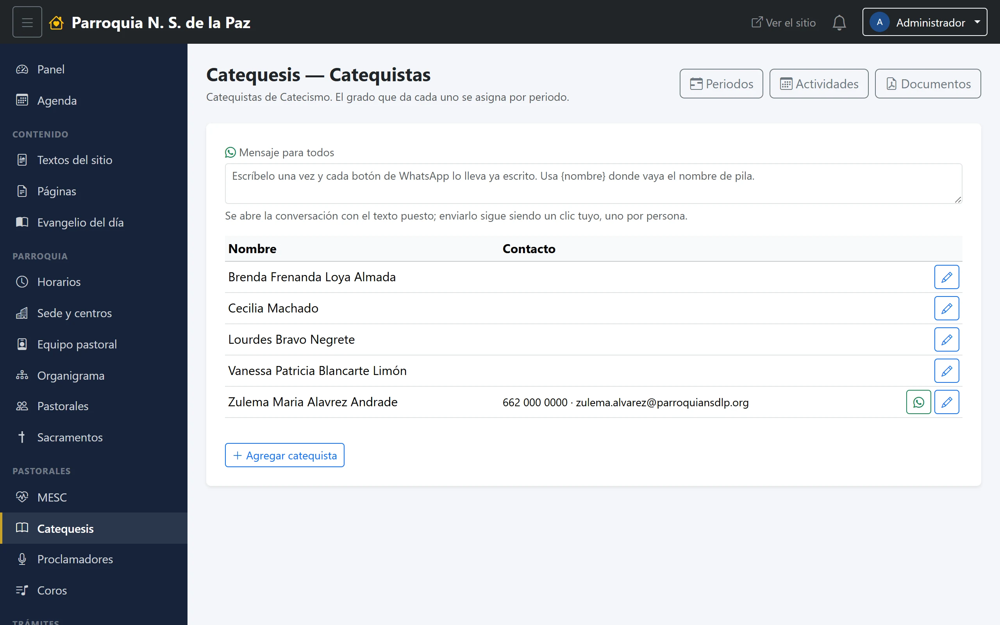
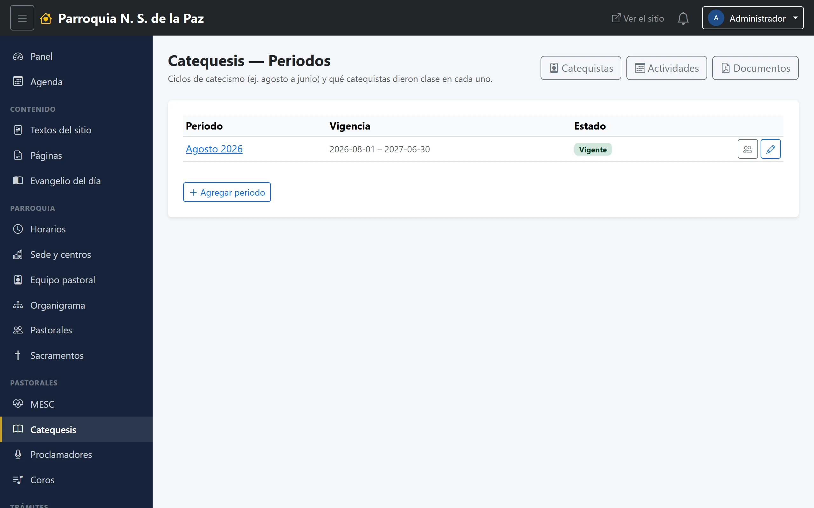

# 16. Catequesis

El módulo de la pastoral de Catequesis: **quién da clase, de qué grado, y en
qué ciclo**.

**Menú:** Pastorales → Catequesis.

## Catequistas

El catálogo de quienes dan catecismo. Como en MESC, cada catequista **se elige
del equipo pastoral**: nombre y teléfono vienen de su ficha y no se vuelven a
escribir. A cada quien se le marca el **grado** que atiende —de Kinder a
Confirmación, pasando por Comunión y los cursos misioneros—, y se le puede
poner activo o inactivo.

Cada renglón trae su botón de **WhatsApp** y arriba está el cuadro de **Mensaje
para todos**: es la forma de mandar el aviso de la junta de catequistas sin
teclearlo doce veces.

## Periodos

Un periodo es un **ciclo de catecismo**: de agosto a junio, normalmente. Cada
uno tiene su nombre, sus fechas de vigencia y su estado, y guarda **qué
catequistas dieron clase en él**.

Eso último es lo que hace útil el módulo con el tiempo: los catequistas cambian
cada año, y el periodo conserva quién estuvo en cada ciclo sin que haya que
llevar la cuenta aparte. Al abrir un periodo se ve su lista y se le agregan o
quitan catequistas.

## Actividades y documentos

Las otras dos pantallas del módulo son las mismas que tiene cualquier pastoral
desde su panel básico:

- **Actividades**, el tablero de lo que la pastoral organiza.
- **Documentos**, los archivos que se descargan desde su página.

No son tablas aparte: son las mismas del panel básico de la pastoral, así que
**un documento se captura una sola vez** y se ve igual desde aquí que desde
Parroquia → Pastorales → Panel básico. Catequesis llegó a tener dos listas de
documentos ciegas la una a la otra; hoy es una sola.
