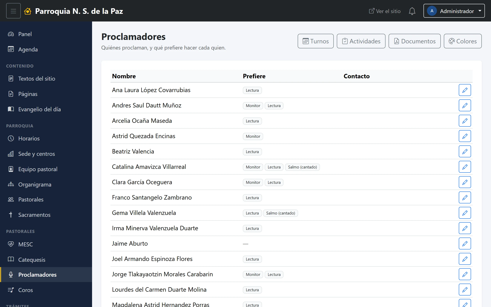
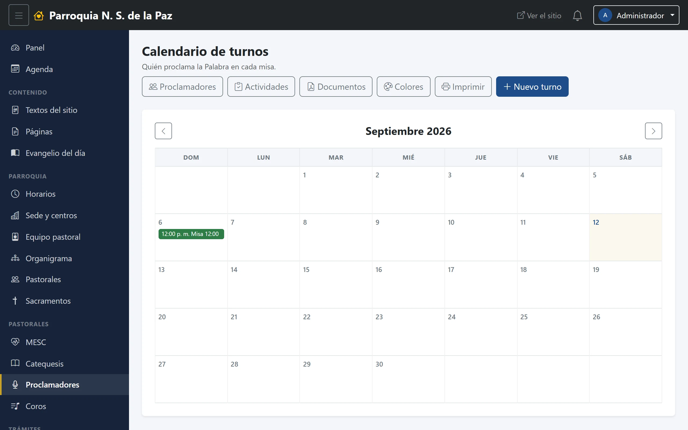

# 17. Proclamadores

La pastoral que proclama la Palabra en las misas. Su módulo tiene cinco
pantallas y abre por la que más se consulta.

**Menú:** Pastorales → Proclamadores.

> Esta pastoral se llamó **Lectores** y después **Liturgia**, y hoy se llama
> Proclamadores. El nombre cambió en todo el panel, pero su dirección pública
> sigue siendo `/pastorales/liturgia`: ya estaba en uso y cambiarla rompería
> los enlaces que la gente tiene guardados. Si ves «liturgia» en una dirección,
> es esto.

## Quiénes proclaman

Es la primera pantalla del módulo, y es así a propósito: **es el dato con el
que se arma un turno**, y por tanto lo que se consulta antes que nada.

Cada persona se elige del equipo pastoral y lleva marcado **qué prefiere
hacer**:

- **Monitor**
- **Lectura**
- **Salmo (cantado)**

Se puede marcar más de una. Quien arma el rol mira esta lista antes de repartir
el mes: el salmo cantado no lo hace cualquiera, y el monitor tampoco.

Como en los demás catálogos, cada renglón trae su **WhatsApp** y arriba está el
**Mensaje para todos**.

## Calendario de turnos

Quién proclama en cada misa, mes a mes, con el mismo funcionamiento que el de
MESC: turnos con su hora y su servicio, colores litúrgicos, y el botón de
**Imprimir / Descargar PDF** para la hoja del mes.

## Colores litúrgicos

El catálogo de referencia —verde, morado, blanco, rojo— con el que se etiquetan
los turnos según el tiempo o la fiesta del día. Es el mismo que usa MESC, en su
propia pantalla.

## Actividades y documentos

Igual que en Catequesis: son las del panel básico de la pastoral, no tablas
aparte. Un documento capturado aquí se ve desde el módulo y desde el panel
básico, porque es el mismo.

## Lo que no tiene

A diferencia de MESC, este módulo **no lleva visitas a enfermos ni rutas**: no
le aplican. Son dos pastorales parecidas en la forma —un catálogo de gente y un
rol de turnos— y distintas en lo que hacen.
