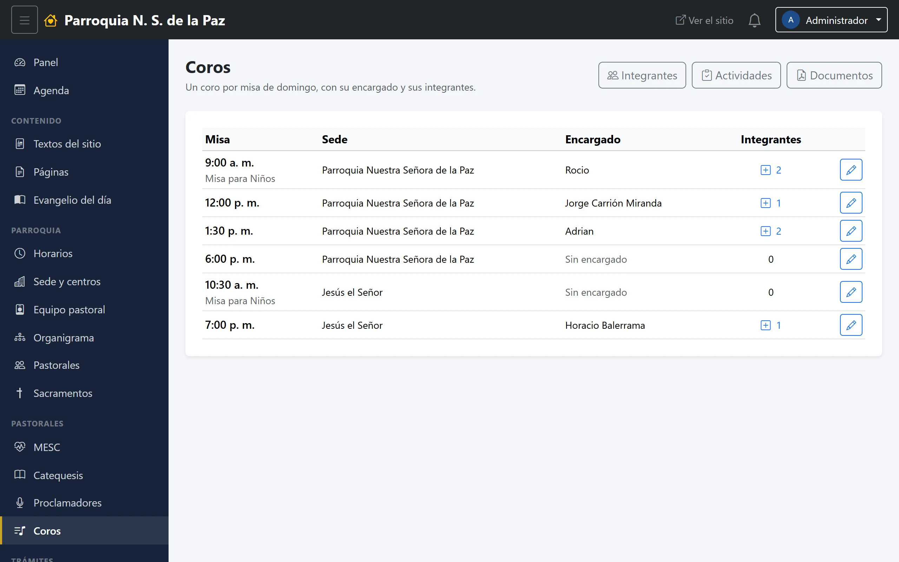
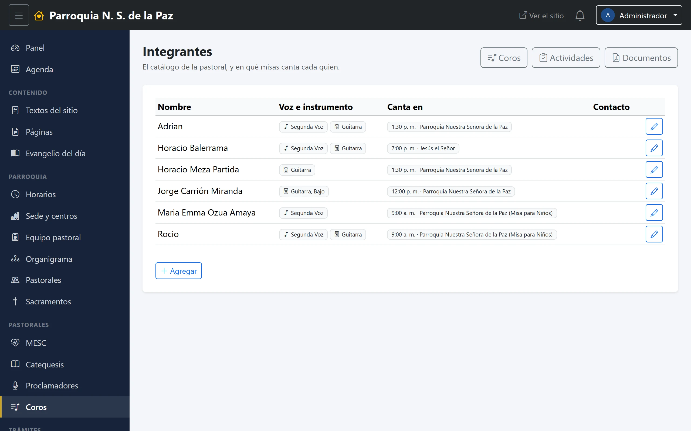

# 18. Coros

La pastoral de música, organizada de una forma propia: **un coro por misa de
domingo**.

**Menú:** Pastorales → Coros.

## Los coros

La lista no se captura: **sale de los horarios**. Cada misa de domingo que
exista en Parroquia → Horarios aparece aquí como un renglón, con su hora y su
sede, y a cada una se le asigna:

- Un **encargado**, elegido del equipo pastoral. Mientras no haya, el renglón
  dice *Sin encargado*.
- Sus **integrantes**, con el número de quienes cantan en esa misa y un **+**
  para agregar a alguien.

Eso tiene una consecuencia práctica: **si una misa de domingo no aparece aquí,
lo que falta es el horario.** Se captura en Horarios y el coro aparece solo.

## Integrantes

El catálogo de la pastoral: quién canta, y en qué misas. Cada persona se elige
del equipo pastoral, como en los demás módulos, y puede estar en más de un
coro.

El listado se despliega con el **+** de cada coro, para poder ver la lista
completa sin que la pantalla se haga interminable. Y como en los otros
catálogos, cada quien trae su botón de **WhatsApp** y arriba está el **Mensaje
para todos**.

## Actividades y documentos

Las dos pantallas de siempre, compartidas con el panel básico de la pastoral:
lo que se captura en una se ve en la otra.
