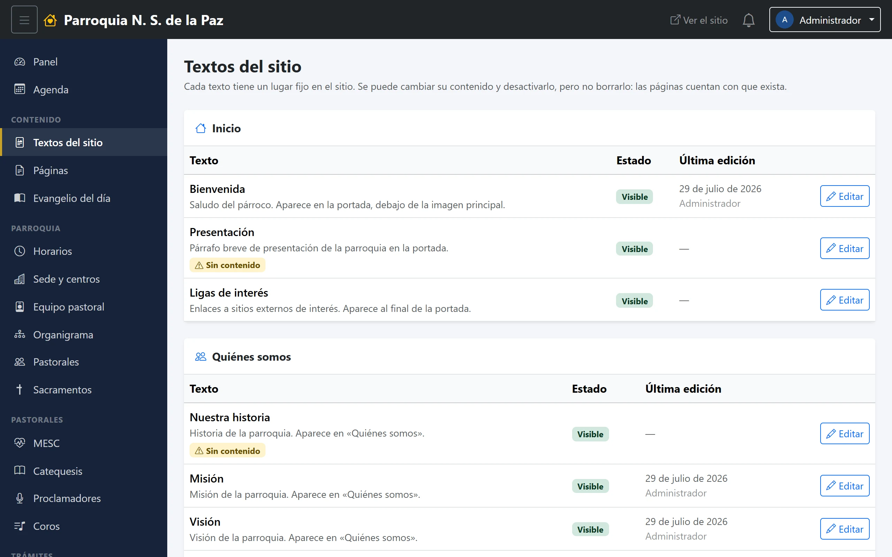
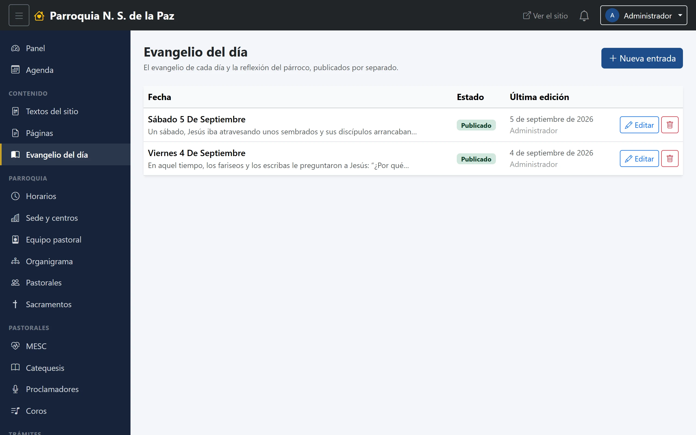

# 19. Páginas, bloques y evangelio del día

Los tres módulos de la sección **Contenido** del menú. Los tres escriben texto
en el sitio, pero cada uno para una cosa distinta:

- **Textos del sitio** (bloques): los párrafos que ya tienen su hueco hecho.
- **Páginas**: secciones nuevas, con su propia dirección.
- **Evangelio del día**: la lectura y la reflexión de cada día.

## Textos del sitio

Son los textos sueltos que el sitio tiene repartidos: la bienvenida del párroco
en la portada, la historia de la parroquia, la misión, la visión, las ligas de
interés, la introducción de la página de sacramentos.

**Aquí no se crean ni se borran**: la lista viene dada, porque cada uno tiene
su hueco reservado en una página concreta. Lo que se hace es **editarlos**. Al
abrir uno, el panel dice dónde aparece, para no tener que adivinarlo.

Cada bloque tiene su **título**, su **contenido** —con el editor de texto— y un
interruptor de **activo**: apagado, la sección simplemente no se dibuja en el
sitio, sin dejar un hueco vacío.

El listado muestra además **la última edición** de cada texto, que es la forma
rápida de ver qué lleva años sin tocarse.

## Páginas

Para lo que no cabe en ningún módulo: la historia larga de la parroquia, un
reglamento, la convocatoria de una peregrinación. Cada página tiene:

- **Título.**
- **Dirección.** La parte final de la URL —`/pagina/reglamento`—, que se genera
  sola a partir del título y se puede corregir. Conviene dejarla quieta una vez
  publicada: si alguien ya la compartió, cambiarla rompe ese enlace.
- **Contenido**, con el editor.
- **Resumen para buscadores.** Dos líneas: es lo que Google muestra debajo del
  título.
- **Orden** y **Publicada**. Mientras no esté publicada, su dirección responde
  «no encontrada».
- **Mostrar en el menú.** Con esta palomita, la página aparece en el menú del
  sitio, después de las secciones fijas.

## Evangelio del día

La lectura del día y, si da tiempo, la reflexión del párroco. Cuando hay una
entrada publicada para hoy, aparece en la portada; si no, la portada
sencillamente no dibuja esa sección.

Cada entrada tiene:

- **Fecha.** Una por día. Si ya existe una entrada para esa fecha, **se
  actualiza en vez de crear otra**, así que no hay manera de acabar con dos
  evangelios del mismo día.
- **Evangelio.** La cita y el texto. No hace falta escribir «EVANGELIO» arriba:
  la portada pone esa etiqueta sola.
- **Reflexión.** Opcional, y a propósito: hay días en que no da tiempo de
  escribirla, y el evangelio debe poder salir igual.
- **Publicado.** Mientras esté apagado, no aparece en el sitio. Es lo que
  permite dejar preparadas las entradas de varios días y que vayan saliendo.
