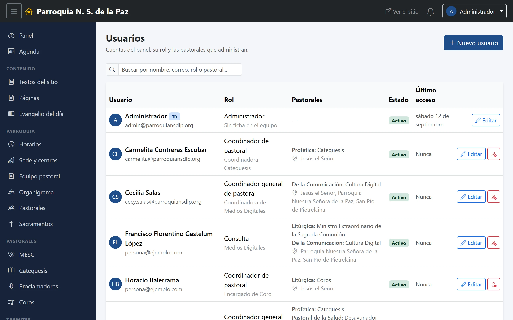

# 20. Usuarios

Las cuentas del panel: quién entra, con qué rol y sobre qué pastorales. El
capítulo 4 explica **qué significa** cada rol; este explica **cómo se dan de
alta y se mantienen**.

**Menú:** Administración → Usuarios.

Lo ve el **Administrador**, y también el **Coordinador general**, pero acotado:
solo las cuentas de su propia pastoral, y nunca las de un rol igual o superior
al suyo.

## El listado

Un buscador por nombre, correo, rol o pastoral, y una tabla que dice de cada
cuenta:

- **Quién es**: su nombre y su correo, y debajo, su cargo según su ficha del
  equipo pastoral. Si la cuenta no está ligada a ninguna ficha, lo dice: *Sin
  ficha en el equipo*.
- **Rol**, con su cargo real debajo.
- **Pastorales** que administra, agrupadas por comisión, y las sedes donde.
- **Estado** y **último acceso**. Ese último dato es más útil de lo que parece:
  una cuenta que dice *Nunca* después de meses es una cuenta que alguien pidió
  y nadie usa.
- Los botones de **Editar** y, para el administrador, el de entrar como esa
  persona.

## Dar de alta una cuenta

El formulario empieza por lo más importante: **elegir a la persona del equipo
pastoral**. De ahí vienen su nombre, su teléfono y su foto, y con eso la cuenta
y la ficha quedan ligadas —es la razón de que ya no haya tres formas distintas
de escribir el mismo nombre—. Si quien va a entrar todavía no está en el
equipo, primero se le hace su ficha (capítulo 12).

Después:

- **Correo**, que es con el que va a entrar.
- **Contraseña**, de al menos ocho caracteres. Al editar una cuenta, dejarla en
  blanco significa «no la cambies».
- **Rol**, con la descripción de lo que ese rol puede hacer debajo del
  selector, para no tener que buscarla en ningún otro lado.
- **Las dos listas de palomitas** —pastorales y sedes—, que solo aparecen para
  los roles acotados. Recuerda la regla del capítulo 4: *Coordinador* pide una
  sede; *Coordinador general* admite varias o ninguna.
- **Activo**, el interruptor que cierra el acceso sin borrar la cuenta.

## Perfiles adicionales

Abajo del formulario hay una sección aparte: **Perfiles adicionales de
acceso**. Es para la persona que hace dos cosas distintas en la parroquia
—coordina una pastoral y en otra solo consulta— sin darle dos cuentas ni dos
contraseñas.

Cada perfil se agrega con su propio rol y su propio alcance, y se guarda por
separado del resto del formulario. Quien tenga uno o más elegirá con cuál entra
al iniciar sesión, y podrá cambiarse desde el menú de su nombre, como explica
el capítulo 2.

## Bajas y contraseñas

- **Cuando alguien deja su encargo**, lo que se hace es **desactivar la
  cuenta**, no borrarla: su rastro en la bitácora sigue teniendo sentido, y si
  vuelve, se reactiva.
- **Si alguien olvidó su contraseña**, se le pone una nueva desde aquí. No hay
  recuperación por correo, así que esta pantalla es el único camino.
- **Conviene revisar la lista de vez en cuando.** Las cuentas que nunca se
  usaron y las de quienes ya no están son la forma más común de que un acceso
  se quede abierto sin que nadie se dé cuenta.
