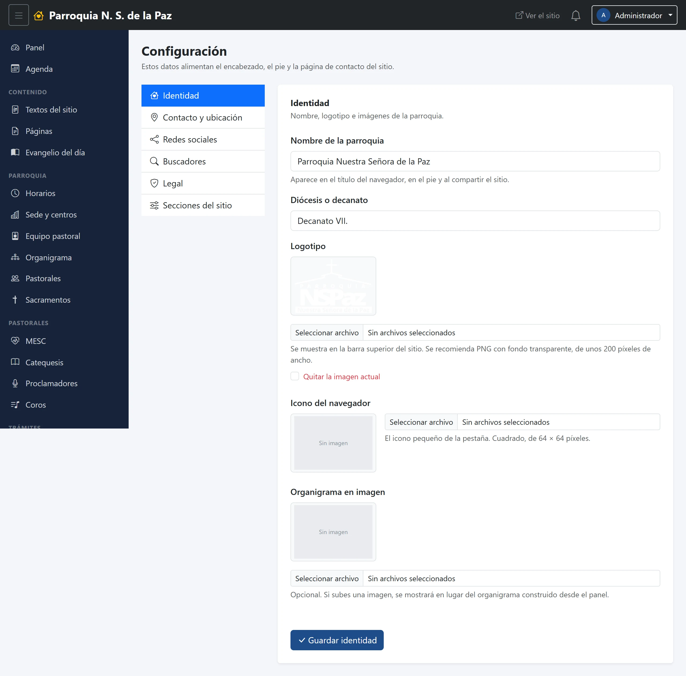

# 21. Configuración

Los datos que el sitio repite en todas partes: el nombre de la parroquia, el
escudo, la dirección, los teléfonos, las redes. Se capturan una vez aquí y se
actualizan solos en el pie, en la página de contacto y en cualquier sitio donde
aparezcan.

**Menú:** Administración → Configuración. Solo el Administrador.

Está partida en seis bloques, y cada uno se guarda por separado.

## Identidad

El **nombre de la parroquia** y su **diócesis o decanato**, el **logotipo** —el
escudo de la barra— y el **icono del navegador**, esa imagen diminuta que sale
en la pestaña. También se puede cargar aquí el **organigrama en imagen**, para
las parroquias que prefieren publicar el suyo como una sola figura en vez de
armarlo nodo por nodo.

## Contacto y ubicación

Dirección, ciudad, código postal, **teléfono**, **WhatsApp** y correo, más el
horario de oficina y el mapa.

Es el bloque que más se nota: lo que se escriba aquí es lo que aparece en el
pie de **todas** las páginas y en la página de Contacto, y es el número al que
la gente llama.

## Redes sociales

Las direcciones de Facebook, Instagram y YouTube. Se dibujan como iconos en el
pie; **las que se dejen en blanco no aparecen**, así que no hay que inventar
una cuenta que no existe.

La de Facebook hace algo más: es la que alimenta el bloque **«Lo último en
Facebook»** de la portada.

## Buscadores

La **descripción del sitio** —lo que Google enseña bajo el título— y la
**imagen al compartir**, que es la que sale cuando alguien pega el enlace de la
parroquia en WhatsApp o en Facebook.

## Legal

Aquí vive la **versión del aviso de privacidad**, que se muestra sin poder
editarse desde esta pantalla. No es un descuido: cada inscripción y cada
mensaje guardan **a qué versión del aviso dijo que sí** la persona que los
mandó, y cambiar ese número sin publicar un aviso nuevo dejaría esos registros
diciendo una mentira. Cuando el aviso cambie de verdad, hay que pedírselo a
quien lleva el sistema.

## Secciones del sitio

Interruptores para partes opcionales del menú público. Hoy el que hay es
**«Mostrar Cursos en el menú»**: apagarlo esconde la sección del sitio sin
borrar nada ni tener que despublicar los cursos uno por uno. Es lo que se usa
cuando no hay convocatorias abiertas.
