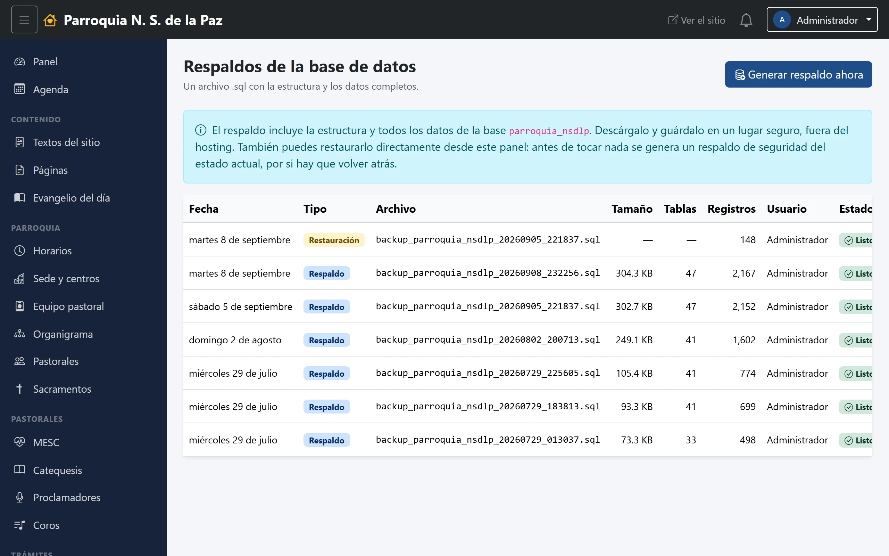
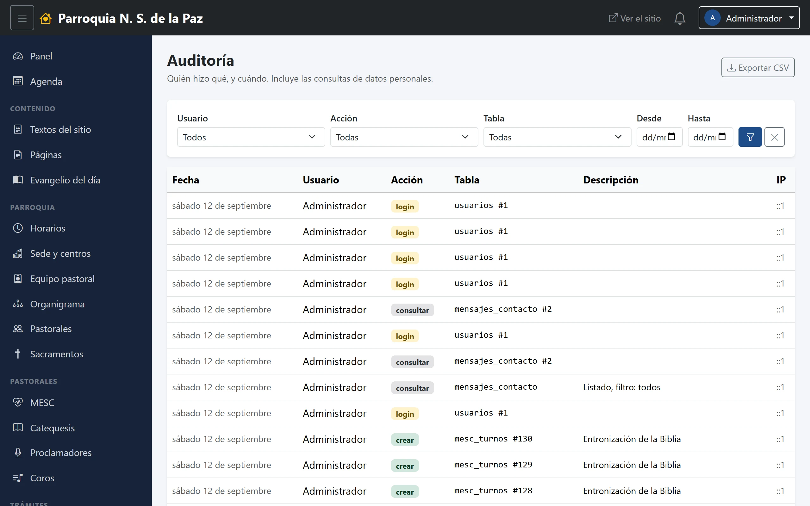

# 22. Respaldos y bitácora

Los dos módulos que no sirven para publicar nada, sino para poder dormir
tranquilo: uno guarda copias de todo, el otro registra quién hizo qué.

**Menú:** Administración → Respaldos y Administración → Auditoría. Los dos,
solo para el Administrador.

## Respaldos

Un respaldo es **un archivo con toda la base de datos**: la estructura y los
datos completos, desde los horarios hasta la última inscripción.

Con **Generar respaldo ahora** se crea uno, y queda en la lista con su fecha,
su tamaño, cuántas tablas y cuántos registros trae, y quién lo generó. Cada
renglón tiene tres botones:

- **Descargar**, que baja el archivo `.sql`.
- **Restaurar**, que devuelve la base a como estaba ese día.
- **Eliminar del historial.**

### Dos advertencias que valen todo el capítulo

> **Descárgalos y guárdalos fuera del hosting.** Un respaldo que vive en el
> mismo servidor que la base no protege del caso que más importa: que el
> servidor se pierda. Bajarlos cada tanto a una computadora o a un disco de la
> parroquia es lo que convierte esta lista en un respaldo de verdad.

> **Restaurar reemplaza todo lo que hay hoy.** Lo capturado después de esa
> fecha desaparece. Por eso el panel pide **confirmar la contraseña del
> administrador** antes de hacerlo, y por eso, antes de tocar nada, **genera
> solo un respaldo del estado actual**: si la restauración no era lo que se
> quería, hay por dónde volver. Esa copia aparece en la lista marcada como
> *Restauración*.

Un respaldo antes de cada cambio grande —una carga masiva, una limpieza de
datos, un cambio de servidor— es la costumbre que conviene tener.

## La bitácora

Registra **quién hizo qué, y cuándo**: cada alta, cada cambio, cada borrado, y
también las consultas de datos personales —quién abrió una inscripción, quién
entró a los mensajes de contacto—.

Se puede filtrar por **usuario**, por **tipo de acción** y por **módulo**, que
es como se responden las preguntas que de verdad se hacen: «¿quién despublicó
el aviso?», «¿quién borró esa foto?», «¿alguien entró a las inscripciones el
mes pasado?».

Dos cosas que conviene saber:

- **La impersonación queda registrada como lo que es.** Cuando el
  administrador usa «Usar como…», la bitácora anota quién es él en realidad. No
  hay forma de actuar en nombre de otra persona sin dejar rastro.
- **No es para vigilar a nadie.** Es para poder reconstruir lo que pasó sin que
  se convierta en una discusión de memoria contra memoria. La mayoría de las
  veces la respuesta es un descuido, y saberlo evita repetirlo.

## Una rutina razonable

Si la parroquia quiere una costumbre mínima, esta basta:

1. **Un respaldo al mes**, y otro antes de cualquier cambio grande.
2. **Descargarlo** y guardarlo fuera del servidor.
3. **Una mirada a la bitácora** cuando algo no cuadre, no todos los días.
4. **Una revisión de las cuentas** (capítulo 20) cada cierto tiempo, para
   cerrar los accesos que ya no hacen falta.
